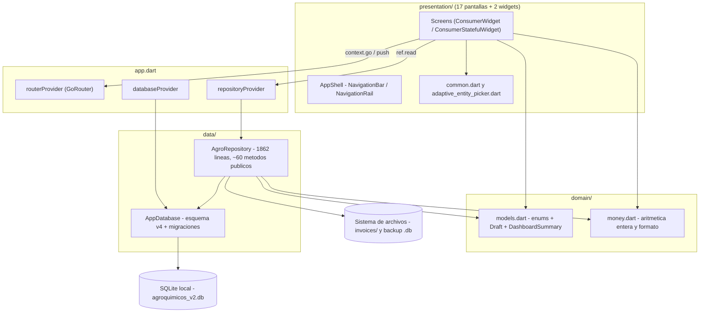
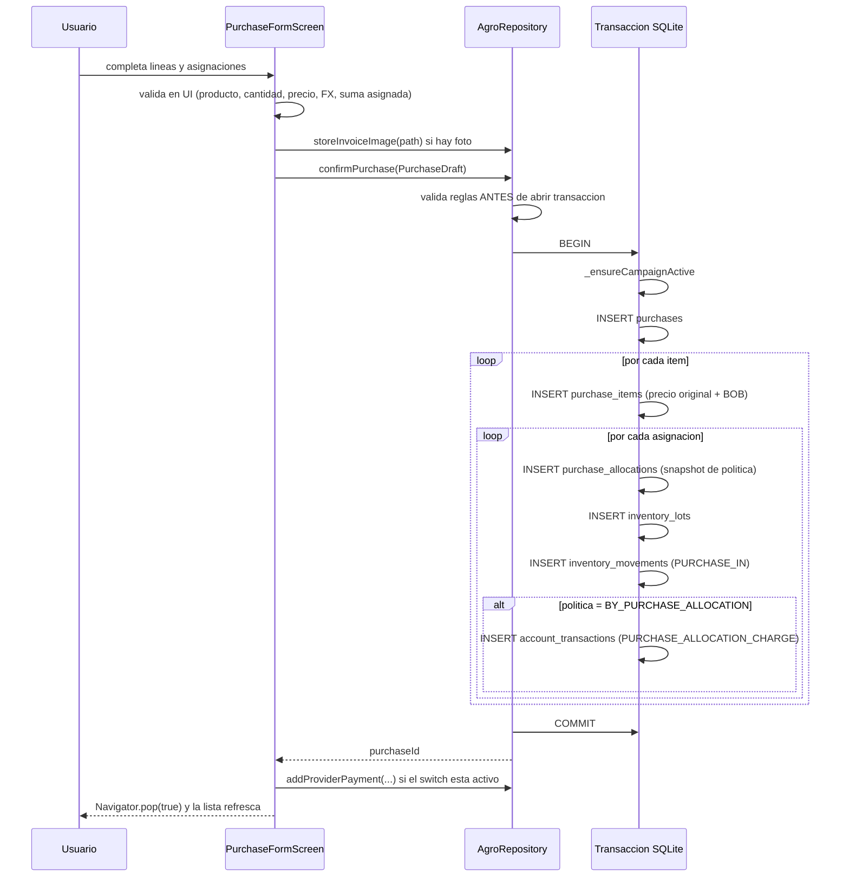

# 02 — Arquitectura

## Resumen honesto

El proyecto **no sigue Clean Architecture, ni MVVM, ni BLoC, ni Redux**. Sigue un patrón
propio de **tres carpetas** con un **repositorio monolítico** que concentra persistencia y
reglas de negocio, y una capa de presentación que lo consume directamente.

No hay capa de casos de uso, ni entidades de dominio, ni DTOs, ni mappers.

```
lib/
├── main.dart          → bootstrap
├── app.dart           → providers raíz + router + tema
├── domain/            → enums, "drafts" de entrada y helpers de dinero (SIN lógica de datos)
├── data/              → AppDatabase (esquema) + AgroRepository (TODA la lógica de negocio)
└── presentation/      → shell, pantallas, widgets compartidos
```

## Diagrama de capas real



## Qué hay en cada capa

### `lib/main.dart` (9 líneas)

`WidgetsFlutterBinding.ensureInitialized()` y `runApp(ProviderScope(child: AgroApp()))`.
Nada más. No hay inicialización de base de datos, ni de crash reporting, ni de logging.

### `lib/app.dart` (151 líneas)

Tres responsabilidades mezcladas en un archivo:

1. **Inyección de dependencias**:
   - `databaseProvider` → crea `AppDatabase()` y registra `ref.onDispose(database.close)`.
   - `repositoryProvider` → `AgroRepository(ref.watch(databaseProvider))`.
2. **Router**: `routerProvider` con un `ShellRoute` de 13 rutas + 4 rutas de nivel superior.
3. **Tema**: `ThemeData` Material 3, semilla `#35693E`, densidad compacta.

Los tests sustituyen la base real vía `repositoryProvider.overrideWithValue(repo)`
(por ejemplo `test/regression_widget_test.dart`), que es el único punto de inyección usado.

### `lib/domain/` (173 líneas totales)

**No es una capa de dominio en el sentido DDD.** Contiene:

- `models.dart` — 4 `enum` (`PersonRole`, `SettlementPolicy`, `CurrencyCode`,
  `ExchangeRateSource`), una `extension EnumCode` que convierte `camelCase` a
  `SCREAMING_SNAKE` para persistir, siete clases `*Draft` inmutables que son **entradas de
  escritura** (`PurchaseDraft`, `PurchaseItemDraft`, `AllocationDraft`, `ApplicationDraft`,
  `ApplicationLineDraft`, `PlanItemDraft`, `TransferItemDraft`) y un único DTO de lectura
  tipado, `DashboardSummary`.
- `money.dart` — aritmética entera para dinero y cantidades, y formateo `es_BO`.

**No existen entidades de lectura tipadas.** Todas las consultas devuelven
`List<Map<String, Object?>>` crudo de sqflite, y la UI hace *casts* por nombre de columna
(`row['product_name'] as String`). Esta es la decisión arquitectónica de mayor impacto en
mantenibilidad del proyecto — ver [24_CODE_QUALITY_AUDIT](24_CODE_QUALITY_AUDIT.md).

### `lib/data/` (2176 líneas — el 26% del código de `lib/`)

- `app_database.dart` (314 líneas) — abre SQLite eligiendo el `DatabaseFactory` según
  plataforma, define el esquema **versión 4** y las migraciones `onUpgrade` desde v1.
  Activa `PRAGMA foreign_keys = ON` en `onConfigure`.
- `agro_repository.dart` (1862 líneas) — **el núcleo del sistema**. Es simultáneamente:
  repositorio, servicio de dominio, motor de costeo FIFO, motor contable y capa de reportes.
  Toda regla de negocio confirmada vive aquí. Lanza `BusinessRuleException` (y su subclase
  `CampaignConflictException`) como único mecanismo de error de dominio.

### `lib/presentation/` (5741 líneas)

- `app_shell.dart` — chrome de navegación adaptativo (bottom bar < 900px, rail >= 900px,
  rail extendido >= 1150px) y el FAB "Nuevo".
- `screens/` — 17 pantallas. Las de lista son `ConsumerStatefulWidget` que guardan un
  `late Future` en `initState`; los formularios manejan editores de línea mutables.
- `widgets/common.dart` — `PageFrame`, `EmptyState`, `showError`/`showSuccess`,
  parsers decimales tolerantes y `friendlyError`.
- `widgets/adaptive_entity_picker.dart` — selector genérico `<T>` con bottom sheet,
  búsqueda a partir de 8 ítems y autoselección cuando hay una sola opción.

## Flujo de una operación de escritura (ejemplo: confirmar compra)



Nota: el pago al proveedor se hace en una **transacción separada** después del `COMMIT` de
la compra. Si el pago falla, la compra queda creada sin pago. Ver
[27_KNOWN_ISSUES](27_KNOWN_ISSUES.md).

## Patrones y decisiones observadas

| Decisión | Evidencia | Consecuencia |
|---|---|---|
| Repositorio único monolítico | `agro_repository.dart` 1862 líneas | Alta cohesión temática, muy baja modularidad; es el archivo con más riesgo de conflicto y regresión |
| SQL crudo en lugar de ORM | `rawQuery` en ~35 métodos | Control fino del costeo FIFO; a costa de nula seguridad de tipos |
| Sin modelos de lectura | Toda consulta devuelve `Map<String, Object?>` | Los errores de nombre de columna son de **runtime**, no de compilación |
| Aritmética entera para dinero | `money.dart`, todo en *minor units* | Correcto: evita errores de coma flotante. Es una fortaleza del proyecto |
| Contabilidad por asiento inmutable | Nunca se hace `UPDATE`/`DELETE` de cargos; se insertan `CREDIT_ADJUSTMENT` | Historia auditable; es una fortaleza |
| Inventario por movimientos | `inventory_movements.quantity_signed`; el stock es `SUM()` | Trazabilidad completa; coste: cada consulta de stock agrega toda la tabla |
| Estado de UI por `FutureBuilder` | `late Future` + `setState` para refrescar | Simple y sin dependencias; no hay invalidación reactiva entre pantallas |

## Lo que **no** existe (verificado)

- No hay interfaces ni abstracciones sobre `AgroRepository` (no existe `IAgroRepository`).
  Los tests inyectan la clase concreta con una BD en memoria.
- No hay casos de uso ni servicios de aplicación.
- No hay mappers ni serialización JSON (`json_serializable`, `freezed`: ausentes).
- No hay inyección de dependencias más allá de los dos `Provider` de `app.dart`.
- No hay capa de caché en memoria: cada `FutureBuilder` va a SQLite.
- No hay manejo centralizado de errores ni logger.
