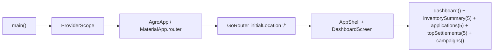
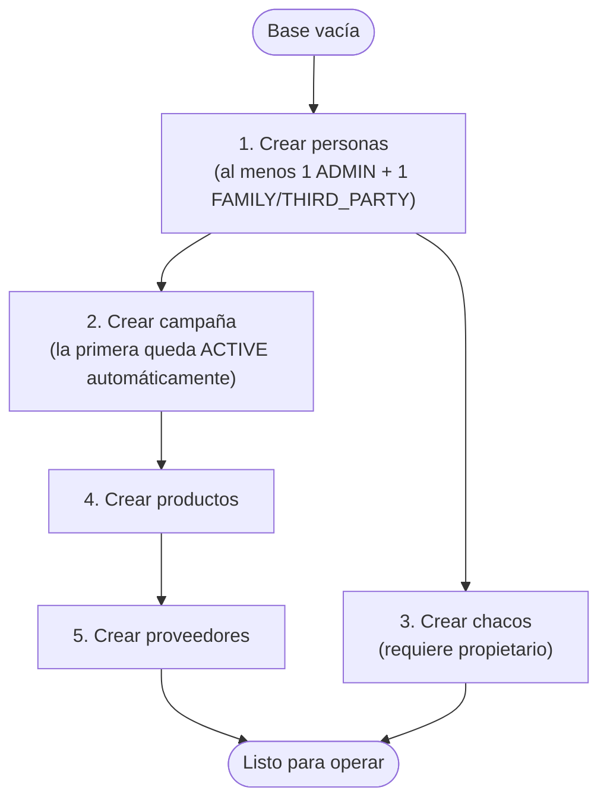
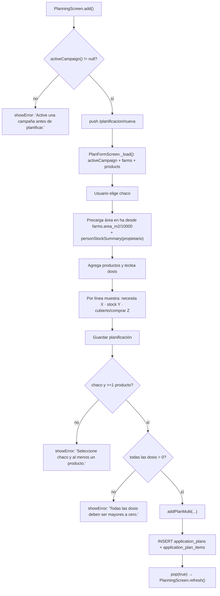
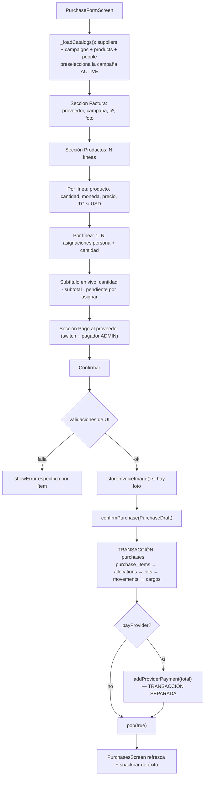
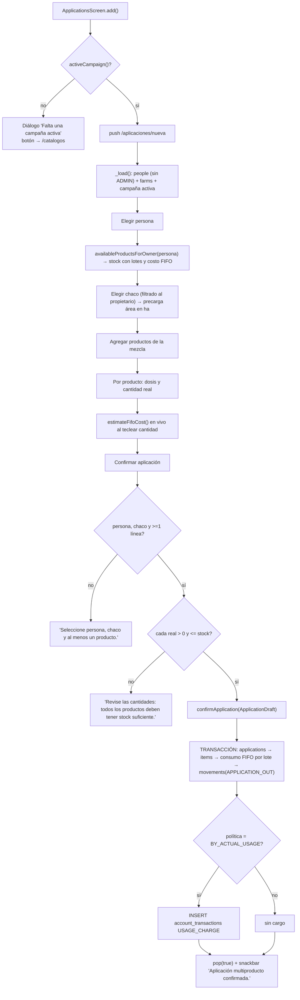
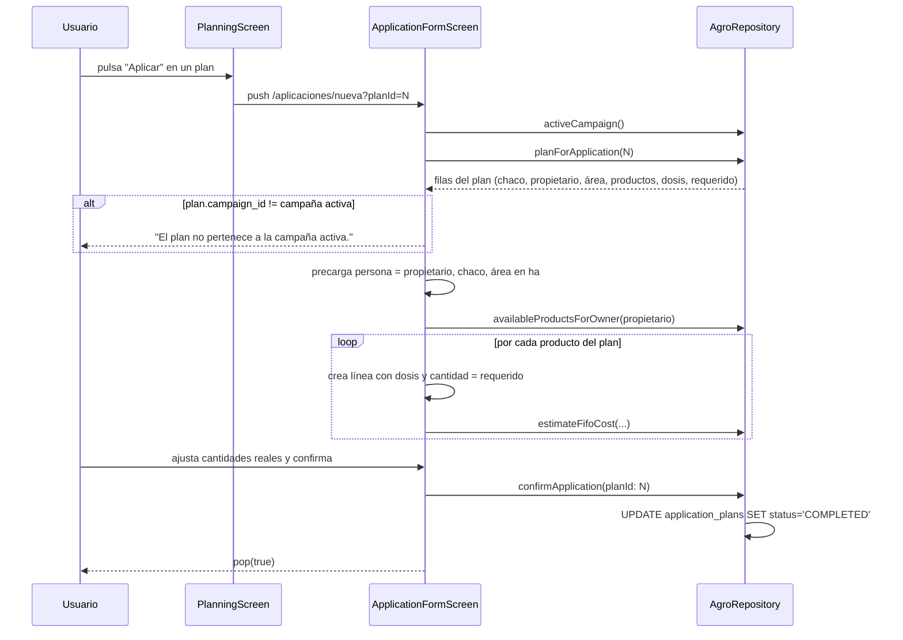
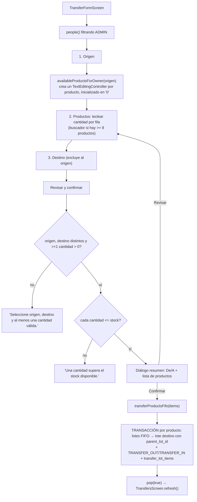
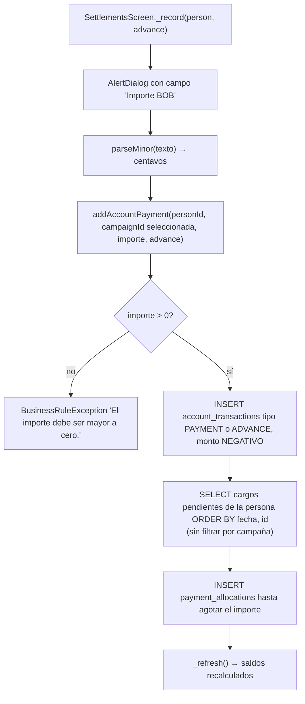
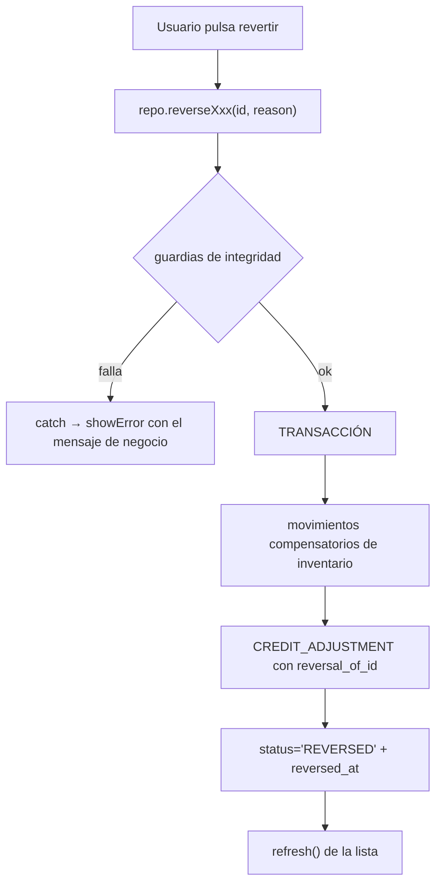
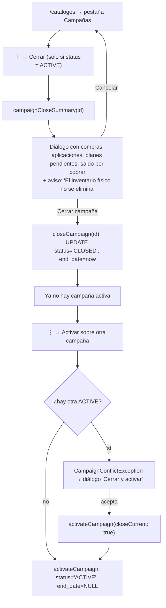

# 06 — Flujos de usuario

Reconstruidos a partir del código de las pantallas y del repositorio. Cada flujo indica su
punto de entrada real y las llamadas concretas que ejecuta.

---

## UF-01 · Apertura de la aplicación



1. **Entrada**: `main.dart` → `WidgetsFlutterBinding.ensureInitialized()` → `runApp`.
2. **No hay splash screen propia** (solo la `LaunchTheme` nativa de Android/iOS).
3. **No hay onboarding, ni comprobación de sesión, ni migración visible al usuario.**
4. La base de datos se abre **de forma perezosa**: `AppDatabase._open()` se dispara con la
   primera consulta, que es la del dashboard. Las migraciones `onUpgrade` corren aquí, de
   forma invisible.
5. **Estado loading**: `CircularProgressIndicator` centrado mientras resuelve el `Future`.
6. **Estado error**: si la apertura de la BD o cualquier consulta falla,
   `EmptyState(icon: error_outline, message: friendlyError(...))`.
7. **Finalización**: dashboard poblado, o con la tabla de inventario vacía y el banner
   "Campaña activa: Sin campaña activa".

> **Primera ejecución real**: la base está vacía. No hay datos semilla. El dashboard se ve
> a ceros y **no hay ninguna guía que lleve al usuario a crear su primera campaña**. Es la
> mayor carencia de UX detectada. Ver [20](20_BUILD_AND_CONFIGURATION.md) y [29](29_IMPROVEMENT_AUDIT.md).

---

## UF-02 · Configuración inicial (orden obligatorio)

El orden **no es opcional**: las dependencias de claves foráneas y las guardias de campaña
lo imponen.



- **Punto de entrada**: `/catalogos` (desde Operaciones → "Administrar datos").
- **Regla que fuerza el orden**: `addFarm` requiere `ownerId` válido (FK a `persons`);
  `confirmPurchase`, `addPlanMulti` y `confirmApplication` llaman `_ensureCampaignActive`.
- **Detalle importante**: `addCampaign` (`agro_repository.dart:74-88`) cuenta las campañas
  activas dentro de una transacción; si no hay ninguna, la nueva nace `ACTIVE`; si ya hay
  una, nace `PLANNED`. **La primera campaña que se crea queda activa sin intervención.**
- **Sin ADMIN no se puede pagar al proveedor**: `PurchasesScreen._pay` avisa "Registra una
  persona administradora para pagar al proveedor."

---

## UF-03 · Planificar una aplicación

**Entrada**: `/planificacion` → botón "Nuevo plan" (o FAB "Nuevo" → "Planificación").



- **Validaciones de UI**: chaco seleccionado, ≥ 1 producto, dosis > 0, producto no repetido
  ("El producto ya está agregado.").
- **Validaciones de repositorio** (defensa en profundidad, mismas reglas): área > 0, ítems
  no vacíos, productos únicos, dosis > 0, campaña activa.
- **Cambio de estado**: plan creado con `status = 'PLANNED'`; el inventario pasa a mostrar
  esa cantidad como **"comprometida"** en `inventorySummary` y en el detalle de producto.
- **Errores posibles**: campaña inactiva, dosis inválida, producto duplicado.
- **Fin**: vuelve a la lista de planificación, agrupada por plan, con botón "Aplicar".

---

## UF-04 · Registrar una compra

**Entrada**: `/compras` → "Nueva compra"; o Operaciones → "Registrar compra";
o FAB "Nuevo" → "Compra" **(esta última ruta tiene un defecto confirmado, ver abajo)**.



**Validaciones de UI, en orden** (`purchase_form_screen.dart` `_confirm`):

1. Proveedor y campaña seleccionados.
2. Al menos una línea.
3. Por línea: producto, cantidad > 0 y precio > 0 → *"Complete producto, cantidad y precio del ítem N."*
4. Por línea USD: TC > 0 → *"Seleccione un tipo de cambio para el ítem N."*
5. Toda asignación tiene persona → *"Seleccione la persona de cada asignación."*
6. Suma asignada == cantidad → *"La suma asignada supera…"* o *"Falta asignar parte…"* (mensaje distinto según el signo).
7. Si el switch de pago está activo, pagador seleccionado.

**Cambios de estado y almacenamiento**: ver [F-04 en 05_FEATURES](05_FEATURES.md).
Para el **familiar** no se crea deuda; para el **tercero** sí, por el importe de su asignación.

**Protección de salida**: `PopScope(canPop: !dirty && !saving)` → diálogo
"¿Descartar cambios?" con "Seguir editando" / "Descartar".

> ⚠️ **Defecto confirmado y reproducido**: si se entra por el FAB "Nuevo" → "Compra", el
> `AppShell` usa `context.go('/compras/nueva')`, que **reemplaza toda la pila**. Al pulsar
> atrás, `Navigator.pop()` dispara la aserción de go_router
> *"You have popped the last page off of the stack, there are no pages left to show"* y la
> pantalla queda en blanco. Entrando desde `/compras` (que usa `context.push`) no ocurre.
> Detalle y reproducción en [27_KNOWN_ISSUES](27_KNOWN_ISSUES.md).

---

## UF-05 · Registrar una aplicación (desde cero)

**Entrada**: `/aplicaciones` → "Registrar".



**Comportamiento acoplado persona↔chaco**: al elegir un chaco cuyo propietario difiere de
la persona actual, `selectFarm` **cambia automáticamente la persona** al propietario y
recarga su stock. Al cambiar de persona, el chaco se limpia siempre.

**Detalle técnico observado**: la limpieza del chaco se decide con
`if (_farmOwner(farmId) != id) farmId = null;`, pero `_farmOwner` **siempre devuelve `null`**
(`application_form_screen.dart`), de modo que la condición es siempre verdadera. El efecto
neto es correcto, pero el método es código muerto engañoso. Ver [26](26_TECHNICAL_DEBT.md).

---

## UF-06 · Aplicar desde un plan (flujo preferente)

**Entrada**: `/planificacion` → expandir un plan → botón "Aplicar".
Navega a `/aplicaciones/nueva?planId=N` (con `context.push`).



**Caso borde manejado**: si un producto del plan **no tiene stock**, el formulario igualmente
crea la línea con un stock ficticio de 0 (`available_base: 0`), para que el usuario vea el
producto planificado; al confirmar, la validación de cantidad ≤ stock lo bloqueará.

**Reversibilidad**: si la aplicación se revierte, `reverseApplication` devuelve el plan a
`PLANNED` (confirmado por test *"aplicación desde plan conserva líneas y completa/reabre el plan"*).

---

## UF-07 · Transferir stock entre personas

**Entrada**: `/transferencias` → "Nueva".



- **Sin efecto contable**: transferir no genera cargos ni créditos.
- **Costo preservado**: el lote destino hereda `unit_cost_bob_minor_per_major_unit`,
  `currency_code`, `original_unit_price_minor`, `exchange_rate_scaled` y `acquired_date`
  del origen — por eso el orden FIFO se mantiene coherente tras la transferencia.
- **Atomicidad**: si cualquier producto no alcanza, no se mueve ninguno.

---

## UF-08 · Registrar un pago o adelanto de una persona

**Entrada**: `/liquidacion` → menú ⋮ de la persona → "Registrar pago" / "Registrar adelanto".



**Comportamiento notable y confirmado por test**: la imputación **cruza campañas**. Un pago
registrado en la campaña 2 cancela primero la deuda más antigua, aunque sea de la campaña 1.
Es intencional (test *"saldo inicial cruza campañas y el pago se imputa a deuda antigua"*).

**Sobrepago**: si el importe supera la deuda total, el remanente **no se imputa** a ningún
cargo, pero **sí** queda registrado como asiento negativo, produciendo saldo a favor. La UI
lo etiqueta "Saldo a favor" y lo pinta en verde.

**Ausencia de validación**: no hay tope superior. Se puede registrar un pago de cualquier
magnitud. Ver [16](16_VALIDATIONS.md).

---

## UF-09 · Consultar el estado de cuenta de una persona

**Entradas**: `/liquidacion` → ⋮ → "Ver detalle cronológico"; o `/personas/:id` → pestaña "Cuenta".

1. `detailedStatement(personId, campaignId)` trae los asientos enriquecidos con `concept` y `farm_name`.
2. Si hay campaña seleccionada, `personCampaignBalance` aporta el `opening_balance`.
3. La UI acumula el saldo movimiento a movimiento y lo muestra bajo cada importe.
4. Iconografía por signo: naranja `+` para cargos, verde `−` para pagos/créditos.
5. **Empty**: "Sin movimientos." solo si no hay filas **y** el saldo inicial es 0.

---

## UF-10 · Revertir una operación

| Operación | Entrada | Confirmación previa | Guardias |
|---|---|---|---|
| Compra | `/compras` → ⋮ → "Revertir compra" | **Ninguna** | Lotes no consumidos y saldo de lote intacto |
| Aplicación | `/aplicaciones` → botón ↩ | **Ninguna** | Ninguna: siempre procede |
| Transferencia | `/transferencias` → botón ↩ | **Ninguna** | Lote destino sin movimientos posteriores |



**Mensajes de guardia reales**:
- *"La compra tiene lotes consumidos. Revierta primero las aplicaciones relacionadas."*
- *"El lote fue transferido o ajustado; requiere reversión consistente previa."*
- *"El stock transferido ya tuvo movimientos. Reviértalos antes de continuar."*
- *"La aplicación ya fue revertida o no existe."*

**Riesgo de UX**: la ausencia de diálogo de confirmación en aplicaciones y transferencias
hace que un toque accidental sobre el icono ↩ ejecute una operación contable irreversible
desde la UI (no hay "des-revertir"). Ver [29](29_IMPROVEMENT_AUDIT.md).

---

## UF-11 · Cerrar una campaña y abrir la siguiente



**Qué sobrevive al cambio de campaña** (confirmado por el test *"catálogo, stock y deuda
permanecen al cambiar campaña"*):

- Catálogos completos.
- **Inventario físico**: los lotes y su saldo se conservan íntegros.
- **Deuda**: los saldos de las personas no se reinician.

**Qué cambia**: las nuevas compras, aplicaciones y planes se asocian a la nueva campaña, y
los reportes filtrados por campaña muestran solo lo nuevo. El "saldo inicial de campaña"
en el estado de cuenta expone lo arrastrado.

---

## UF-12 · Exportar backup

**Entrada**: `/liquidacion` → "Exportar backup".

1. `PRAGMA wal_checkpoint(FULL)` — vuelca el WAL al archivo principal.
2. Comprueba que `appDatabase.openedPath` no sea nulo ni `:memory:`.
3. Copia a `getDownloadsDirectory()` (o Documentos) como `agroquimicos_backup_<ISO>.db`.
4. Snackbar con la ruta completa.

**Fin del flujo**: no hay compartir, ni subir, ni verificar. El usuario debe encontrar el
archivo por sí mismo. **No existe el flujo inverso de restauración.**

---

## Flujos que NO existen

Buscados y no encontrados en el código: registro de usuario, login, recuperación de
contraseña, logout, edición de perfil propio, onboarding, sincronización, resolución de
conflictos, actualización forzada de versión, calificación en tienda, soporte/contacto,
términos y condiciones, exportación selectiva, restauración de backup.

---

# Actualización 2026-09-06 — Flujos afectados por el cierre de la baseline

## Aplicar un plan (una sola vez)

```
Operaciones -> Planificación
  la lista muestra sólo planes PENDIENTES
  tocar la fila -> se despliega -> "Aplicar este plan"
    -> formulario de aplicación precargado (persona, chaco, área, productos, dosis)
    -> Confirmar aplicación
      -> aplicación creada
      -> el plan pasa a APPLIED
      -> al volver, la lista se recarga y el plan YA NO ESTÁ
  "Mostrar planes aplicados" -> aparece marcado "Aplicado", sin acción de aplicar
```

Si se intenta aplicar otra vez por cualquier vía —pantalla desactualizada, doble toque, llamada
indirecta— el repositorio lo rechaza: *"Este plan ya fue aplicado y no puede volver a
aplicarse. Cree un plan nuevo si necesita repetir la aplicación."* No se crea una segunda
aplicación ni se gasta stock.

**Revertir la aplicación no devuelve el plan a pendiente.** Para repetir la planificación se
crea un plan nuevo.

## Cerrar una campaña (irreversible)

```
Operaciones -> Administrar datos -> Campañas -> menú de la campaña ACTIVA -> Cerrar
  -> confirmación que declara:
       periodo desde qué fecha
       compras y aplicaciones registradas
       planes pendientes
       saldo por cobrar
       que dejará de admitir compras, aplicaciones, transferencias y planes
       que NO podrá reactivarse desde la aplicación
  -> "Cerrar definitivamente" (en color de acción irreversible)
     -> la campaña queda Cerrada, con su rango de fechas
     -> su menú pasa a ofrecer sólo "Editar"
```

Sólo una campaña `PLANNED` ofrece "Activar". Para seguir operando se crea una campaña nueva.

## Respaldar y restaurar con fotografías

```
Cuentas -> icono de carpeta -> Exportar respaldo
  -> archivo .agrobackup en la carpeta de descargas de la aplicación
  -> el acuse dice cuántas fotografías incluye
  -> si alguna factura ya no tiene su foto en el teléfono, se avisa (no se oculta)

Cuentas -> icono de carpeta -> Restaurar respaldo
  -> lista de respaldos disponibles (contenedores nuevos y .db históricos)
  -> elegir uno -> la confirmación declara ANTES de aceptar:
       versión de esquema
       si trae fotografías y cuántas, o que es formato histórico y no las trae
       que TODOS los datos actuales se reemplazan
       que se guardará una copia de los datos actuales
  -> Restaurar
     -> base restaurada, fotografías devueltas a su carpeta, rutas reapuntadas
     -> el acuse indica cuántas fotografías se restauraron y dónde quedó la copia previa
     -> si hubo discrepancias, se muestran
     -> el historial de compras abre la fotografía restaurada
```

Ante cualquier fallo a mitad, se deshace **el conjunto**: no queda una base nueva con las fotos
viejas ni al revés.

## Crear una entrada de catálogo

```
Operaciones -> Administrar datos -> elegir sección
  -> "Agregar persona" / "chaco" / "producto" / "proveedor" / "campaña"
     (una sola acción primaria: en esta ruta no hay FAB)
  -> Guardar con un campo obligatorio vacío
     -> el campo se marca y aparece el motivo BAJO él
     -> el diálogo NO se cierra y NO se escribe nada
```
