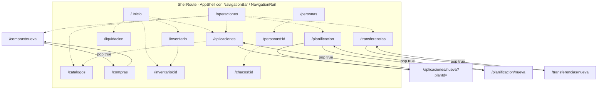

# 08 — Navegación

Motor: **`go_router` 17.5.0**, configurado íntegramente en `lib/app.dart` (`routerProvider`).
`MaterialApp.router` recibe `routerConfig: ref.watch(routerProvider)`.

## Tabla completa de rutas

Las 17 rutas del `GoRouter`, tal como están declaradas:

| # | Ruta | Pantalla | ¿Dentro del `ShellRoute`? | Parámetros |
|---|---|---|:--:|---|
| 1 | `/` | `DashboardScreen` | ✅ | — |
| 2 | `/operaciones` | `OperationsScreen` | ✅ | — |
| 3 | `/catalogos` | `CatalogsScreen` | ✅ | — |
| 4 | `/planificacion` | `PlanningScreen` | ✅ | — |
| 5 | `/compras` | `PurchasesScreen` | ✅ | — |
| 6 | `/aplicaciones` | `ApplicationsScreen` | ✅ | — |
| 7 | `/liquidacion` | `SettlementsScreen` | ✅ | — |
| 8 | `/inventario` | `InventoryScreen` | ✅ | — |
| 9 | `/inventario/:id` | `InventoryDetailScreen` | ✅ | path `id` → `int.parse` |
| 10 | `/personas` | `PersonsScreen` | ✅ | — |
| 11 | `/personas/:id` | `PersonDetailScreen` | ✅ | path `id` → `int.parse` |
| 12 | `/chacos/:id` | `FarmLogbookScreen` | ✅ | path `id` → `int.parse` |
| 13 | `/transferencias` | `TransfersScreen` | ✅ | — |
| 14 | `/transferencias/nueva` | `TransferFormScreen` | ❌ nivel superior | — |
| 15 | `/compras/nueva` | `PurchaseFormScreen` | ❌ nivel superior | — |
| 16 | `/aplicaciones/nueva` | `ApplicationFormScreen` | ❌ nivel superior | query `planId` → `int.tryParse` |
| 17 | `/planificacion/nueva` | `PlanFormScreen` | ❌ nivel superior | — |

**Criterio de diseño evidente**: las pantallas de **consulta** viven dentro del shell (con
barra/rail de navegación siempre visible); los **formularios de creación** son pantallas
completas sin shell, que se apilan encima.

> ⚠️ Las rutas de creación son hijas *textuales* de las de listado (`/compras/nueva` bajo
> `/compras`) pero **hermanas estructurales**: están declaradas fuera del `ShellRoute`, no
> como `routes:` anidadas. Esto es lo que habilita el defecto de navegación descrito abajo.

## Mapa de navegación real

Flechas continuas = `context.push` (apila, permite volver).
Flechas punteadas = `context.go` (reemplaza la ubicación).



## El shell de navegación

`AppShell` (`lib/presentation/app_shell.dart`) recibe `location: state.uri.path` y decide
qué destino resaltar.

**5 destinos**:

| Índice | Ruta | Icono | Etiqueta |
|---|---|---|---|
| 0 | `/` | `space_dashboard_outlined` | Inicio |
| 1 | `/operaciones` | `task_alt_outlined` | Operaciones |
| 2 | `/inventario` | `inventory_2_outlined` | Inventario |
| 3 | `/personas` | `people_alt_outlined` | Personas |
| 4 | `/liquidacion` | `account_balance_wallet_outlined` | Cuentas |

**Resolución del índice activo** (`AppShell.selectedIndex`), en tres pasos:

1. Si la ubicación es (o empieza por) `/catalogos`, `/planificacion`, `/compras`,
   `/aplicaciones` o `/transferencias` → devuelve **1** (Operaciones). Es decir, todas las
   pantallas operativas se agrupan visualmente bajo "Operaciones" aunque no sean esa ruta.
2. Si hay coincidencia exacta con un destino → ese índice.
3. Si la ubicación empieza por `<destino>/` (rutas de detalle como `/personas/7`) → ese índice.
4. Si nada coincide (p. ej. `/chacos/3`) → **0** (Inicio).

**Adaptación por ancho** (`MediaQuery.sizeOf(context).width`):

| Ancho | Chrome |
|---|---|
| < 900 px | `NavigationBar` inferior |
| ≥ 900 px | `NavigationRail` lateral + `VerticalDivider` |
| ≥ 1150 px | `NavigationRail` con `extended: true` (muestra etiquetas) |

El `FloatingActionButton.extended` "Nuevo" está presente en ambos modos.

## FAB "Nuevo"

Abre un `showModalBottomSheet` con 5 accesos directos. **Todos usan `context.go`**, tras
cerrar la hoja con `Navigator.of(sheetContext).pop()` y un `addPostFrameCallback`:

| Etiqueta | Destino | ¿Está en el shell? | Consecuencia |
|---|---|:--:|---|
| Planificación | `/planificacion` | ✅ | Correcto |
| **Compra** | `/compras/nueva` | ❌ | **Rompe la navegación** (ver abajo) |
| Aplicación | `/aplicaciones` | ✅ | Correcto (lleva a la lista, no al formulario) |
| Pago | `/liquidacion` | ✅ | Correcto |
| Transferencia | `/transferencias` | ✅ | Correcto |

## Defecto confirmado: `go` hacia una ruta de nivel superior

**Reproducido empíricamente durante esta auditoría** con un test aislado (ejecutado fuera
del repositorio y ya eliminado; el código fuente no fue modificado).

**Pasos**: arrancar la app → FAB "Nuevo" → "Compra" → pulsar el botón atrás del formulario.

**Resultado observado**:

```
EXCEPTION CAUGHT BY SCHEDULER LIBRARY
The following assertion was thrown during a scheduler callback:
You have popped the last page off of the stack, there are no pages left to show
'package:go_router/src/delegate.dart':
Failed assertion: line 178 pos 7: 'currentConfiguration.isNotEmpty'

#2  GoRouterDelegate._debugAssertMatchListNotEmpty (delegate.dart:178:7)
#3  GoRouterDelegate._completeRouteMatch (delegate.dart:199:5)
#4  GoRouterDelegate._handlePopPageWithRouteMatch (delegate.dart:153:7)
#5  _CustomNavigatorState._handlePopPage (builder.dart:437:42)
#6  NavigatorState.pop (navigator.dart:5654:28)
#7  _PurchaseFormScreenState._close.<anonymous closure>
    (package:agroquimicos/presentation/screens/purchase_form_screen.dart:110:42)
```

Tras el atrás, ni "Nueva compra" ni "Inicio" están en el árbol: **la pantalla queda en blanco**.

**Causa raíz**: `context.go('/compras/nueva')` **reemplaza** toda la pila de rutas por esa
única ruta de nivel superior. Cuando `PurchaseFormScreen._close()` ejecuta
`Navigator.of(context).pop()`, no queda ninguna página debajo.

**Alcance**: afecta a las dos entradas que usan `go` hacia `/compras/nueva`:
- `AppShell._newButton` (FAB → "Compra")
- `OperationsScreen` (tarjeta "Registrar compra")

**No afecta** a `PurchasesScreen._newPurchase`, que usa `context.push` y funciona bien.
Las otras tres rutas de formulario (`/planificacion/nueva`, `/aplicaciones/nueva`,
`/transferencias/nueva`) **solo** se alcanzan con `push`, por lo que están a salvo.

Registrado como **P0** en [29_IMPROVEMENT_AUDIT](29_IMPROVEMENT_AUDIT.md) y detallado en
[27_KNOWN_ISSUES](27_KNOWN_ISSUES.md).

## Contrato de retorno de los formularios

Los cuatro formularios devuelven `bool?` mediante `Navigator.pop(true)` al guardar con
éxito. Quien los abre con `push<bool>` comprueba el resultado:

```dart
final saved = await context.push<bool>('/transferencias/nueva');
if (saved == true && mounted) refresh();
```

Presente en `TransfersScreen`, `ApplicationsScreen`, `PlanningScreen` y `PurchasesScreen`.
Es un patrón consistente y correcto.

## Protección contra pérdida de datos (`PopScope`)

Los cuatro formularios implementan el mismo contrato:

```dart
PopScope(
  canPop: !dirty && !saving,
  onPopInvokedWithResult: (didPop, _) {
    if (!didPop && !saving) _close();   // muestra "¿Descartar cambios?"
  },
  child: ...
)
```

Y el cierre efectivo se difiere un frame:

```dart
setState(() => dirty = false);
WidgetsBinding.instance.addPostFrameCallback((_) {
  if (mounted) Navigator.of(context).pop();
});
```

El `addPostFrameCallback` existe para que `canPop` ya valga `true` cuando se ejecuta el
`pop`, evitando que `PopScope` lo intercepte otra vez. Es una solución correcta, y está
cubierta por `test/back_navigation_test.dart`, que **replica el contrato en un arnés
aislado** (`_DirtyFormHarness`) en lugar de probar los formularios reales — ver
[22_TESTING](22_TESTING.md).

## Transiciones

```dart
pageTransitionsTheme: const PageTransitionsTheme(builders: {
  TargetPlatform.android: FadeForwardsPageTransitionsBuilder(),
  TargetPlatform.iOS: FadeForwardsPageTransitionsBuilder(),
})
```

Transición unificada en ambas plataformas. No hay transiciones personalizadas por ruta.

## Lo que NO existe en la navegación

- **Sin `redirect`**: no hay guardas de ruta. Cualquier ruta es accesible directamente
  (coherente con la ausencia de autenticación).
- **Sin `errorBuilder`**: una ruta desconocida usa la pantalla de error por defecto de
  go_router, no una 404 propia.
- **Sin `refreshListenable`**: el router no reacciona a cambios de estado.
- **Sin deep links** configurados en `AndroidManifest.xml` ni en `Info.plist`
  (no hay `intent-filter` de `VIEW`, ni `CFBundleURLTypes`).
- **Sin rutas anidadas** (`routes:` dentro de un `GoRoute`): las 17 rutas son planas dentro
  del `ShellRoute` o a nivel superior.
- **Sin `StatefulShellRoute`**: al cambiar de pestaña, la pantalla se reconstruye y **pierde
  su estado y su posición de scroll**; los `late Future` de `initState` se relanzan.
- **Sin navegación por gestos** ni `Hero` animations.
