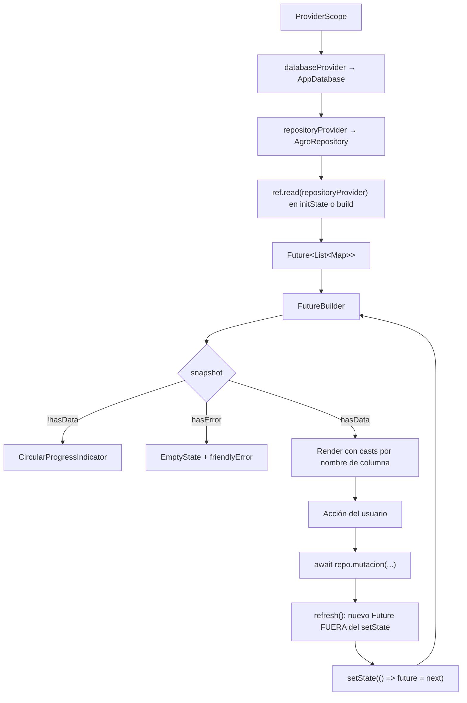

# 09 — Gestión de estado

## Resumen

El proyecto usa **Riverpod únicamente como contenedor de inyección de dependencias**, no
como sistema de estado. El estado de datos se maneja con el patrón clásico
**`late Future` + `FutureBuilder` + `setState`**.

Esto es importante entenderlo bien porque contradice la expectativa habitual de un
proyecto que declara `flutter_riverpod` en sus dependencias.

## Los tres providers (y solo tres)

Todos en `lib/app.dart`:

```dart
final databaseProvider = Provider<AppDatabase>((ref) {
  final database = AppDatabase();
  ref.onDispose(database.close);
  return database;
});

final repositoryProvider = Provider<AgroRepository>(
  (ref) => AgroRepository(ref.watch(databaseProvider)),
);

final routerProvider = Provider<GoRouter>((ref) => GoRouter(...));
```

| Provider | Tipo | Alcance | Notas |
|---|---|---|---|
| `databaseProvider` | `Provider<AppDatabase>` | Singleton de app | Libera con `ref.onDispose(database.close)` |
| `repositoryProvider` | `Provider<AgroRepository>` | Singleton de app | Único punto de override en tests |
| `routerProvider` | `Provider<GoRouter>` | Singleton de app | Se lee con `ref.watch` en `AgroApp.build` |

**No se usa ningún otro tipo de provider.** Verificado por búsqueda: no hay
`StateProvider`, `StateNotifierProvider`, `NotifierProvider`, `AsyncNotifierProvider`,
`FutureProvider`, `StreamProvider`, `ChangeNotifierProvider` ni `.family`/`.autoDispose`.

## Cómo se leen los datos

### Patrón A — pantallas con estado (el más usado)

Usado en Dashboard, Inventory, Applications, Planning, Purchases, Transfers, Settlements,
Catalogs y los cuatro formularios.

```dart
class _InventoryScreenState extends ConsumerState<InventoryScreen> {
  late Future<List<Map<String, Object?>>> future;

  @override
  void initState() {
    super.initState();
    future = ref.read(repositoryProvider).inventorySummary();   // se lanza UNA vez
  }

  void refresh() {
    final next = ref.read(repositoryProvider).inventorySummary(); // fuera del setState
    setState(() => future = next);
  }

  @override
  Widget build(BuildContext context) => FutureBuilder(future: future, builder: ...);
}
```

**Detalle deliberado y verificado**: el `Future` se crea **antes** del `setState`, nunca
dentro. Existe un test de regresión dedicado a esto —
`regression_widget_test.dart`: *"ningún refresh devuelve Future desde setState"*—, lo que
indica que en algún momento fue un bug real. Es una buena práctica bien defendida.

### Patrón B — pantallas sin estado (problemático)

Usado en `PersonsScreen`, `PersonDetailScreen`, `InventoryDetailScreen`, `FarmLogbookScreen`.

```dart
class PersonDetailScreen extends ConsumerWidget {
  Future<_PersonData> _load(WidgetRef ref) async { ... 5 consultas ... }

  @override
  Widget build(BuildContext context, WidgetRef ref) =>
      FutureBuilder<_PersonData>(future: _load(ref), builder: ...);  // ⚠️ en build()
}
```

**Consecuencia real**: el `Future` se recrea en **cada reconstrucción**, relanzando todas
las consultas y volviendo momentáneamente al estado *loading*. Cualquier cambio de tamaño,
de teclado o de `MediaQuery` dispara consultas redundantes. En `PersonDetailScreen` son
**5 consultas por reconstrucción**. Detalle en [25_PERFORMANCE_AUDIT](25_PERFORMANCE_AUDIT.md).

Estas mismas cuatro pantallas **no tienen botón de refresco**, así que un cambio hecho en
otra pantalla no se refleja hasta que algo fuerce la reconstrucción.

### Agrupación de consultas: *records* de Dart

Cuando una pantalla necesita varias consultas, se agrupan en un *record* con nombre:

```dart
typedef _PersonData = ({
  Map<String, Object?> profile,
  List<Map<String, Object?>> farms,
  List<Map<String, Object?>> applications,
  List<Map<String, Object?>> stock,
  List<Map<String, Object?>> statement,
});
```

Buen uso de la característica del lenguaje. Presente en `_DashboardData`, `_PersonData`,
`_FarmData`, `_InventoryDetail`, `_ApplicationCatalogs`, `_PlanCatalogs`.

**Excepción notable**: `SettlementsScreen` usa un record **posicional de 4 elementos**
declarado en línea, lo que produce una firma de tipo de 8 líneas repetida dos veces en el
archivo. Es el punto más ilegible del proyecto en cuanto a tipos.

**Nota de rendimiento**: `_DashboardData` y `_PersonData` encadenan sus consultas con
`await` **secuencial**, no con `Future.wait`. Solo `CatalogsScreen._load` y
`PurchaseFormScreen._loadCatalogs` usan `Future.wait` (paralelo).

## Estado local de los formularios

Los formularios manejan estado mutable con clases editoras propias, no con providers:

| Clase | Archivo | Contenido |
|---|---|---|
| `_PurchaseLineEditor` | `purchase_form_screen.dart` | `productId`, `currency`, 3 `TextEditingController` (cantidad, precio, TC), lista de `_AllocationEditor`, y getters derivados (`quantityBase`, `priceMinor`, `exchangeRateScaled`, `unitBob`, `subtotalBob`, `assignedBase`) |
| `_AllocationEditor` | idem | `personId` + controller de cantidad |
| `_ApplicationLineEditor` | `application_form_screen.dart` | `product` (Map), controllers `dose` y `real`, `cost` calculado |
| `_PlanLine` | `plan_form_screen.dart` | `product` (Map) + controller `dose` |
| (sin clase) | `transfer_form_screen.dart` | `Map<int, TextEditingController> quantities` indexado por `product_id` |

Todas implementan `dispose()` y se liberan correctamente desde el `dispose()` del `State`.
**No se detectaron fugas de `TextEditingController`** en la revisión.

### Banderas de estado transitorio

Los cuatro formularios comparten tres banderas:

- `dirty` — hay cambios sin guardar; gobierna `PopScope.canPop`
- `saving` — operación en curso; deshabilita botones y el atrás
- `loadingStock` / `loadingProducts` — carga secundaria en curso (spinner localizado)

### Guardas contra condiciones de carrera

El código las maneja de forma consistente y correcta:

```dart
// transfer_form_screen.dart — descarta el resultado si el origen cambió mientras cargaba
if (!mounted || fromId != id) return;

// application_form_screen.dart — descarta el costo si la cantidad cambió mientras estimaba
if (mounted && q == (tryParseBase(line.real.text) ?? 0)) setState(() => line.cost = cost);

// plan_form_screen.dart
if (!mounted || farmId != farm['id']) return;
```

Y `if (!mounted) return;` antes de cada `setState`/`showError` tras un `await`. Este aspecto
está **bien resuelto** en todo el proyecto.

## Estado del selector adaptativo

`AdaptiveEntityPicker` mantiene su propio estado interno:

- `autoSelectionScheduled` — evita autoseleccionar en bucle;
- se reinicia en `didUpdateWidget` cuando cambia el número de ítems o el valor;
- la autoselección se difiere con `addPostFrameCallback` para no llamar `onChanged`
  durante el `build`.

`_EntityPickerSheetState` mantiene el `TextEditingController` de búsqueda y la `query`.

## Diagrama del ciclo de datos



## Limitaciones estructurales de este enfoque

| Limitación | Manifestación concreta |
|---|---|
| **Sin invalidación entre pantallas** | Registrar un pago en `/liquidacion` no actualiza el dashboard ni `/personas`. El usuario debe recargar manualmente donde exista el botón, o navegar de nuevo |
| **Sin caché** | Cada visita a una pantalla reejecuta sus consultas contra SQLite |
| **Sin estado compartido** | El filtro de campaña se reinicia en cada pantalla; `SettlementsScreen` guarda el suyo en `selectedCampaignId` con la bandera `campaignInitialized`, pero es local |
| **Pérdida de estado al cambiar de pestaña** | Sin `StatefulShellRoute`, cada cambio de destino reconstruye la pantalla desde `initState` y pierde scroll, filtros y búsquedas |
| **`ref.read` en lugar de `ref.watch`** | Correcto aquí porque el repositorio nunca cambia, pero significa que la UI no puede reaccionar a nada |
| **Sin manejo de estado optimista** | Toda acción espera al `await` completo antes de reflejarse |

## Cómo lo aprovechan los tests

El único punto de inyección es `repositoryProvider`:

```dart
await tester.pumpWidget(
  ProviderScope(
    overrides: [repositoryProvider.overrideWithValue(repo)],
    child: const MaterialApp(home: PlanFormScreen()),
  ),
);
```

Se usa en `regression_widget_test.dart` y `responsive_v5_test.dart`, con un
`AgroRepository` real apuntando a una base SQLite **en memoria** vía `databaseFactoryFfi`.
No hay mocks: los widget tests ejercitan la lógica de negocio de verdad. Ver
[22_TESTING](22_TESTING.md).

`widget_test.dart` monta `AgroApp` **sin override**, por lo que usa la base real del
sistema; solo comprueba que la navegación se renderiza.
