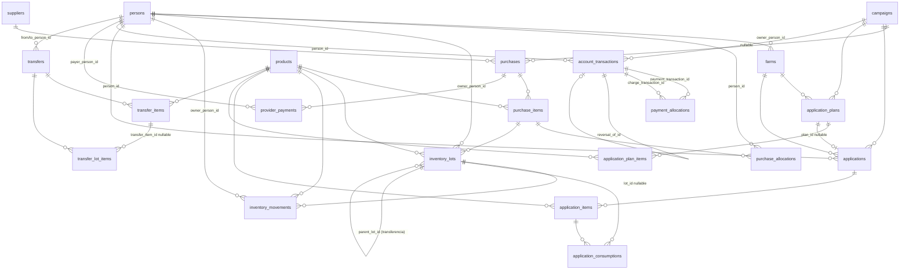

# 10 — Modelo de datos

Fuente única: `lib/data/app_database.dart` (`_createSchema`, esquema **versión 5**) y
`lib/domain/models.dart`.

## Convenciones de unidades — leer antes que nada

Todo el sistema trabaja con **enteros**; no hay `double` en la persistencia. Cuatro escalas:

| Sufijo | Escala | Significado | Ejemplo |
|---|---|---|---|
| `_base` | ×1 000 | Cantidad en unidad base: **mililitros** (productos `L`) o **gramos** (productos `KG`) | `42000` = 42 L |
| `_minor` | ×100 | Dinero en **centavos** de bolivianos | `470400` = Bs 4 704,00 |
| `_scaled` | ×1 000 000 | Tipo de cambio | `7000000` = 7,00 Bs/USD |
| `_m2` | ×10 000 | Superficie en **metros cuadrados** (1 ha = 10 000 m²) | `280000` = 28 ha |

Constantes en `lib/domain/money.dart`: `fxScale = 1000000`, `baseUnitsPerMajor = 1000`.

`unit_cost_bob_minor_per_major_unit` = costo en centavos **por unidad mayor** (por litro o
por kilo), no por unidad base. De ahí `costForBaseQuantity(cantidad_base, costo_unitario)`
que divide entre 1 000.

## Diagrama entidad-relación



## Tablas — 22 en total

### Catálogos maestros

#### `persons`
| Columna | Tipo | Notas |
|---|---|---|
| `id` | INTEGER PK AUTOINCREMENT | |
| `name` | TEXT NOT NULL | Se guarda con `.trim()` |
| `role` | TEXT NOT NULL | `CHECK(role IN ('ADMIN','FAMILY','THIRD_PARTY'))` |
| `settlement_policy` | TEXT NOT NULL | `BY_ACTUAL_USAGE` / `BY_PURCHASE_ALLOCATION` / `MANUAL`. **Sin `CHECK`** |
| `phone` | TEXT | Nunca se escribe desde la UI |
| `active` | INTEGER NOT NULL DEFAULT 1 | Archivado lógico |
| `created_at` | TEXT NOT NULL | ISO-8601 UTC |

#### `farms` (chacos)
| Columna | Tipo | Notas |
|---|---|---|
| `id` | INTEGER PK | |
| `owner_person_id` | INTEGER NOT NULL → `persons(id)` | |
| `name` | TEXT NOT NULL | |
| `area_m2` | INTEGER NOT NULL | `CHECK(area_m2 > 0)` |
| `location` | TEXT | Nunca se escribe desde la UI |
| `active` | INTEGER NOT NULL DEFAULT 1 | |

#### `campaigns`
| Columna | Tipo | Notas |
|---|---|---|
| `id` | INTEGER PK | |
| `name` | TEXT NOT NULL | |
| `start_date` | TEXT NOT NULL | ISO-8601 UTC |
| `end_date` | TEXT | Se fija al cerrar; se limpia al reactivar |
| `status` | TEXT NOT NULL DEFAULT `'PLANNED'` | `PLANNED` / `ACTIVE` / `CLOSED` / `ARCHIVED`. **Sin `CHECK`** |

> `idx_campaign_single_active` es un **índice único parcial**:
> `CREATE UNIQUE INDEX ... ON campaigns((1)) WHERE status='ACTIVE'` — impone a nivel de
> motor que solo exista una campaña activa. Es el control de integridad más elegante del esquema.
> `ARCHIVED` se **lee** en `activateCampaign` pero **nunca se escribe**: es un estado inalcanzable.

#### `products`
| Columna | Tipo | Notas |
|---|---|---|
| `id` | INTEGER PK | |
| `name` | TEXT NOT NULL | |
| `active_ingredient` | TEXT | |
| `unit` | TEXT NOT NULL | `CHECK(unit IN ('L','KG'))` |
| `base_unit` | TEXT NOT NULL | `CHECK(base_unit IN ('ML','G'))` — derivado: `unit=='L' ? 'ML' : 'G'` |
| `active` | INTEGER NOT NULL DEFAULT 1 | |

#### `suppliers`
`id`, `name` NOT NULL, `phone`, `notes`, `active` DEFAULT 1.

---

### Planificación

#### `application_plans`
`id`, `farm_id` → `farms`, `campaign_id` → `campaigns`, `planned_date` (nullable, **nunca
se escribe desde la UI**), `status` DEFAULT `'DRAFT'` (pero `addPlanMulti` siempre inserta
`'PLANNED'`), `notes`.

Estados observados en el código: `PLANNED` (al crear), `COMPLETED` (al confirmar una
aplicación con ese `planId`), vuelta a `PLANNED` (al revertirla). `DRAFT` solo existe como
valor por defecto de la columna y se consulta en los `WHERE status IN ('DRAFT','PLANNED')`
de las métricas de "comprometido"; **ninguna ruta de código lo escribe**.

#### `application_plan_items`
`id`, `plan_id` → `application_plans`, `product_id` → `products`, `area_m2` NOT NULL,
`dose_base_per_ha` NOT NULL, `required_quantity_base` NOT NULL.

`UNIQUE INDEX idx_plan_item_unique (plan_id, product_id)`.

---

### Compras

#### `purchases`
| Columna | Notas |
|---|---|
| `supplier_id`, `campaign_id` | FKs obligatorias |
| `purchase_date` | ISO-8601 UTC |
| `invoice_number` | Se guarda `''` (cadena vacía) si el usuario no escribe nada, no `NULL` |
| `default_currency_code`, `default_exchange_rate_scaled` | **Tomados de `items.first`** — engañosos en facturas mixtas BOB/USD |
| `exchange_rate_source` | `AGREED_WITH_SUPPLIER` / `OFFICIAL_REFERENCE` / `MANUAL` / `OTHER`. La UI **siempre** manda `AGREED_WITH_SUPPLIER` si hay alguna línea en USD |
| `exchange_rate_note` | Existe en el esquema y en `PurchaseDraft`, pero **la UI nunca la rellena** |
| `total_bob_minor` | Suma de subtotales convertidos |
| `status` | `CONFIRMED` / `REVERSED` |
| `notes` | Existe en el draft; **la UI nunca la rellena** |
| `invoice_image_path` | Ruta absoluta al archivo copiado |
| `reversed_at` | `NULL` mientras esté vigente |

#### `purchase_items`
| Columna | Notas |
|---|---|
| `quantity_base` | Cantidad comprada |
| `price_major_unit` | `INTEGER NOT NULL DEFAULT 1000` — **columna muerta**: nunca se escribe ni se lee en `lib/` |
| `currency_code` | `BOB` / `USD` |
| `original_unit_price_minor` | Precio tal como lo tecleó el usuario, en su moneda |
| `exchange_rate_scaled` | `NULL` obligatorio si BOB; obligatorio > 0 si USD |
| `converted_unit_price_bob_minor` | Precio unitario ya convertido a BOB |
| `original_subtotal_minor` | Subtotal en moneda original |
| `subtotal_bob_minor` | Subtotal en BOB |

Guardar **precio original + FX + precio convertido** es la decisión que permite auditar
históricamente una compra en dólares aunque el tipo de cambio cambie después. Es correcto.

#### `purchase_allocations`
`purchase_item_id`, `person_id`, `quantity_base`, `charge_policy_snapshot` NOT NULL
(**copia de la política de la persona en el momento de la compra** — así, cambiar la
política después no reescribe la historia), `amount_bob_minor_if_allocation_charge`
(solo si la política era `BY_PURCHASE_ALLOCATION`), `notes`.

#### `provider_payments`
`purchase_id`, `payer_person_id`, `payment_date`, `amount_bob_minor`
`CHECK(amount_bob_minor > 0)`, `method` NOT NULL (la UI **siempre** manda `'TRANSFER'`),
`notes`, `reversed_at`.

---

### Inventario

#### `inventory_lots`
| Columna | Notas |
|---|---|
| `purchase_item_id` | NOT NULL — **incluso en lotes creados por transferencia**, que heredan el del origen |
| `product_id`, `owner_person_id` | |
| `acquired_date` | Heredado del lote origen en transferencias → **preserva el orden FIFO** |
| `initial_quantity_base` | Cantidad con la que nació el lote |
| `unit_cost_bob_minor_per_major_unit` | Costo histórico, **inmutable** |
| `currency_code`, `original_unit_price_minor`, `exchange_rate_scaled` | Trazabilidad de origen |
| `parent_lot_id` | → `inventory_lots(id)`. `NULL` = viene de compra; con valor = viene de transferencia |
| `notes`, `reversed_at` | |

**El lote no guarda saldo.** El disponible se calcula siempre como
`SUM(inventory_movements.quantity_signed) GROUP BY lot_id`.

#### `inventory_movements` — el libro mayor del inventario
| Columna | Notas |
|---|---|
| `lot_id` | → `inventory_lots(id)`, **nullable** (aunque en la práctica siempre se rellena) |
| `product_id`, `owner_person_id` | Desnormalizados para consultar sin `JOIN` |
| `movement_date` | |
| `type` | Sin `CHECK`. Valores emitidos por el código: `PURCHASE_IN`, `APPLICATION_OUT`, `APPLICATION_REVERSAL`, `PURCHASE_REVERSAL`, `TRANSFER_OUT`, `TRANSFER_IN`, `TRANSFER_REVERSAL_IN`, `TRANSFER_REVERSAL_OUT` |
| `quantity_signed` | **Positivo = entrada, negativo = salida** |
| `reference_type`, `reference_id` | Polimórfico: `PURCHASE_ALLOCATION`, `APPLICATION`, `APPLICATION_REVERSAL`, `PURCHASE_REVERSAL`, `TRANSFER`, `TRANSFER_REVERSAL`, `INVENTORY_LOT` |
| `notes` | |

---

### Aplicaciones

#### `applications`
`farm_id`, `person_id`, `campaign_id`, `plan_id` (nullable), `applied_at`, `status`
(`CONFIRMED`/`REVERSED`), `total_cost_bob_minor` DEFAULT 0, `treated_area_m2`, `notes`,
`reversed_at`.

#### `application_items`
| Columna | Notas |
|---|---|
| `application_id`, `product_id` | `UNIQUE INDEX idx_application_item_unique (application_id, product_id)` |
| `quantity_base` | Cantidad real aplicada |
| `cost_bob_minor` | Suma de los consumos FIFO de esta línea |
| `treated_area_m2`, `dose_base_per_ha`, `theoretical_quantity_base` | Añadidos en v2 |
| `unit` | Copia de `products.unit` en el momento de aplicar (añadido en v4) |
| `variance_quantity_base` | `real − teórico`; `NULL` si no había teórico |
| `fifo_estimated_cost_bob_minor` | **Siempre igual a `cost_bob_minor`** — se escriben con el mismo valor en el mismo `UPDATE`. Redundante |
| `notes` | Columna creada en v4, **nunca escrita ni leída** |

#### `application_consumptions` — trazabilidad FIFO
`application_item_id`, `inventory_lot_id`, `quantity_consumed_base`, `cost_bob_minor`,
`reversed_at`.

Una fila por cada **lote tocado**: aplicar 50 L que abarcan 2 lotes produce 2 filas.
Es lo que permite responder "de qué compra salió el producto que se aplicó aquel día".

---

### Contabilidad

#### `account_transactions` — libro de asientos inmutable
| Columna | Notas |
|---|---|
| `person_id` | |
| `campaign_id` | **Nullable**: un pago sin campaña seleccionada queda con `NULL` |
| `transaction_date` | |
| `type` | Sin `CHECK`. Valores: `PURCHASE_ALLOCATION_CHARGE`, `USAGE_CHARGE`, `PAYMENT`, `ADVANCE`, `CREDIT_ADJUSTMENT` |
| `amount_bob_minor_signed` | **Positivo = cargo (deuda); negativo = pago o crédito** |
| `reference_type`, `reference_id` | `PURCHASE_ALLOCATION` / `APPLICATION` / `APPLICATION_REVERSAL` / `PURCHASE_REVERSAL` / `PAYMENT` / `ADVANCE` |
| `notes` | |
| `reversal_of_id` | → `account_transactions(id)`; enlaza el crédito con el cargo que anula |

**Nunca se hace `UPDATE` ni `DELETE` sobre esta tabla.** Corregir = insertar un asiento
compensatorio. Es el diseño correcto para contabilidad y una fortaleza real del proyecto.

#### `payment_allocations` — imputación de pagos a cargos
`payment_transaction_id`, `charge_transaction_id`, `amount_bob_minor`
`CHECK(amount_bob_minor > 0)`, `UNIQUE(payment_transaction_id, charge_transaction_id)`.

Implementa el "método FIFO de deuda": un pago se reparte contra los cargos más antiguos.
La restricción `UNIQUE` impide imputar dos veces el mismo par pago-cargo.

---

### Transferencias

#### `transfers`
`product_id`, `from_person_id`, `to_person_id`, `transfer_date`, `quantity_base`,
`total_cost_bob_minor`, `status` DEFAULT `'CONFIRMED'`, `notes`, `reversed_at`,
`CHECK(from_person_id <> to_person_id)`.

> **Herencia de la versión mono-producto**: `product_id` y `quantity_base` se rellenan con
> `validItems.first`. En una transferencia de 3 productos, la cabecera describe **solo el
> primero**. El detalle real vive en `transfer_items`. La consulta `transfers()` lo compensa
> con un `COALESCE` que prefiere el `GROUP_CONCAT` de `transfer_items` y usa la cabecera solo
> como respaldo para transferencias antiguas (V3). Funciona, pero es una desnormalización
> engañosa. Ver [26_TECHNICAL_DEBT](26_TECHNICAL_DEBT.md).

#### `transfer_items` (añadida en v4)
`transfer_id`, `product_id`, `quantity_base` `CHECK(> 0)`, `total_cost_bob_minor`,
`UNIQUE(transfer_id, product_id)`.

#### `transfer_lot_items`
`transfer_id`, `transfer_item_id` (nullable, añadida en v4), `source_lot_id`,
`destination_lot_id`, `quantity_base`, `cost_bob_minor`.

---

### `app_settings`

```sql
CREATE TABLE app_settings (key TEXT PRIMARY KEY, value TEXT NOT NULL)
```

Desde la versión 5 se crea también al migrar, no solo en instalaciones nuevas.

Primer uso real: la migración v5 registra en ella la clave
`schema_v5_duplicate_anomaly` cuando encuentra filas duplicadas que impiden imponer la
unicidad. Fuera de ese caso la tabla sigue vacía.

## Índices (15 en `_createSchema`)

| Índice | Tabla | Propósito |
|---|---|---|
| `idx_movements_lot` | `inventory_movements(lot_id)` | Saldo por lote |
| `idx_account_person_campaign` | `account_transactions(person_id, campaign_id, transaction_date)` | Estados de cuenta y saldos |
| `idx_lots_fifo` | `inventory_lots(product_id, owner_person_id, acquired_date, id)` | **El índice clave del FIFO** |
| `idx_campaign_single_active` | `campaigns((1)) WHERE status='ACTIVE'` | ÚNICO PARCIAL — invariante de campaña |
| `idx_campaigns_status` | `campaigns(status)` | |
| `idx_applications_filters` | `applications(campaign_id, person_id, farm_id, applied_at)` | Filtros de la lista |
| `idx_application_items_product` | `application_items(product_id)` | |
| `idx_inventory_filters` | `inventory_movements(product_id, owner_person_id, movement_date)` | |
| `idx_inventory_lots_owner` | `inventory_lots(product_id, owner_person_id)` | |
| `idx_purchases_campaign_date` | `purchases(campaign_id, purchase_date)` | |
| `idx_transfers_filters` | `transfers(product_id, from_person_id, to_person_id, transfer_date)` | |
| `idx_products_active_name` | `products(active, name)` | |
| `idx_application_item_unique` | **UNIQUE** `application_items(application_id, product_id)` | Sin productos repetidos |
| `idx_plan_item_unique` | **UNIQUE** `application_plan_items(plan_id, product_id)` | Sin productos repetidos |
| `idx_transfer_items_transfer_product` | `transfer_items(transfer_id, product_id)` | |

## Migraciones

`onUpgrade` acumulativo desde la versión 1:

| Versión | Cambios |
|---|---|
| **→ 2** | `ALTER TABLE application_items` + `treated_area_m2`, `dose_base_per_ha`, `theoretical_quantity_base` |
| **→ 3** | Cierra campañas activas sobrantes dejando la más reciente; crea `payment_allocations`, `transfers`, `transfer_lot_items`; crea 7 índices condicionados a la existencia de la tabla |
| **→ 4** | Crea `transfer_items`; `ALTER transfer_lot_items` + `transfer_item_id`; `ALTER application_items` + `unit`, `variance_quantity_base`, `fifo_estimated_cost_bob_minor`, `notes`; `ALTER applications` + `treated_area_m2`, `plan_id`; crea 3 índices |
| **→ 5** | **Corrige la divergencia de esquema**: recrea `idx_application_item_unique` e `idx_plan_item_unique` como `UNIQUE`, y crea `app_settings` si falta. No borra ni modifica datos |

Las migraciones v3 y v4 consultan `sqlite_master` antes de actuar, lo que las hace
tolerantes a bases parcialmente formadas. Es una precaución razonable.

> ### ✅ Divergencia entre creación y migración — CORREGIDA en v5
>
> Hasta la versión 4, dos índices se creaban **`UNIQUE`** en `_createSchema` pero **sin
> `UNIQUE`** al migrar, y `app_settings` no se creaba en ninguna ruta de migración. Eso
> dejaba dos esquemas distintos en producción.
>
> La **migración a v5** (`_upgradeToV5`) los recrea como `UNIQUE` y crea `app_settings` si
> falta. Si encuentra filas duplicadas preexistentes **no borra nada**: conserva el índice no
> único y registra la anomalía en `app_settings` bajo la clave
> `schema_v5_duplicate_anomaly`, para que el propietario la revise.
>
> `test/schema_equivalence_test.dart` compara el esquema migrado con el creado desde cero
> —tablas, columnas, tipos, nullability, defaults e índices **con su atributo `unique`**— y
> falla si vuelven a divergir.

> ### ⚠️ Discrepancia entre README y código
>
> `README.md` afirma: *"La versión de esquema SQLite es 2"*. El código declara
> `version: 4` (`app_database.dart`). El README está desactualizado en dos versiones.

## Modelos de dominio (`lib/domain/models.dart`)

### Enums

| Enum | Valores | Código persistido (vía `EnumCode`) |
|---|---|---|
| `PersonRole` | `admin`, `family`, `thirdParty` | `ADMIN`, `FAMILY`, `THIRD_PARTY` |
| `SettlementPolicy` | `byActualUsage`, `byPurchaseAllocation`, `manual` | `BY_ACTUAL_USAGE`, `BY_PURCHASE_ALLOCATION`, `MANUAL` |
| `CurrencyCode` | `bob`, `usd` | `BOB`, `USD` |
| `ExchangeRateSource` | `agreedWithSupplier`, `officialReference`, `manual`, `other` | `AGREED_WITH_SUPPLIER`, `OFFICIAL_REFERENCE`, `MANUAL`, `OTHER` |

La `extension EnumCode` hace `camelCase → SCREAMING_SNAKE` con una expresión regular.
**Es unidireccional**: no existe la operación inversa. Al leer, el código compara cadenas
literales (`person['role'] == 'ADMIN'`), sin volver al enum. Ver [24](24_CODE_QUALITY_AUDIT.md).

### Drafts (entradas de escritura, inmutables)

```
PurchaseDraft
├── supplierId, campaignId, purchaseDate
├── invoiceNumber?, exchangeRateSource?, exchangeRateNote?, notes?, invoiceImagePath?
└── items: List<PurchaseItemDraft>
    ├── productId, quantityBase, currency, originalUnitPriceMinor, exchangeRateScaled?
    └── allocations: List<AllocationDraft> { personId, quantityBase }

ApplicationDraft
├── personId, farmId, campaignId, appliedAt, treatedAreaM2?, planId?, notes?
└── lines: List<ApplicationLineDraft>
    { productId, quantityBase, treatedAreaM2?, doseBasePerHa?, theoreticalQuantityBase? }

PlanItemDraft      { productId, doseBasePerHa }
TransferItemDraft  { productId, quantityBase }
```

### Único DTO de lectura tipado

```dart
class DashboardSummary {
  final int purchasesBobMinor, providerPaidMinor, familyReceivableMinor,
            thirdPartyReceivableMinor, receivedMinor, stockBase;
}
```

## Transformación de datos: lo que realmente ocurre

**No existe** la cadena `API → DTO → Domain → UI State`. La transformación real es
asimétrica:

**Escritura (tipada):**
```
Widgets con TextEditingController
  → tryParseBase / tryParseMinor / tryParseDecimal  (String → int escalado)
  → *Draft (inmutable, tipado)
  → AgroRepository valida
  → Map<String, Object?> → sqflite insert
```

**Lectura (sin tipos):**
```
SQLite
  → List<Map<String, Object?>>       ← el "modelo" termina aquí
  → la pantalla hace casts por nombre: row['product_name'] as String
  → formatBob / formatQuantity
  → Text(...)
```

El camino de escritura está bien diseñado. El de lectura **no tiene ninguna capa de tipos**:
un error de nombre de columna o un cambio de tipo produce un `TypeError` en tiempo de
ejecución, no un error de compilación. Es el mayor riesgo de mantenibilidad del proyecto.
Ver [24_CODE_QUALITY_AUDIT](24_CODE_QUALITY_AUDIT.md) y [29_IMPROVEMENT_AUDIT](29_IMPROVEMENT_AUDIT.md).

## Aritmética monetaria (`lib/domain/money.dart`)

```dart
int divideRoundedHalfUp(int numerator, int denominator) {
  if (denominator <= 0 || numerator < 0) throw ArgumentError(...);
  return (numerator + denominator ~/ 2) ~/ denominator;
}
```

Redondeo **mitad hacia arriba**, consistente en todo el sistema.

| Función | Fórmula |
|---|---|
| `convertedUnitPriceBobMinor(precio, fx)` | `fx == null ? precio : redondeo(precio × fx / 1e6)` |
| `subtotalMinor(cant, precio, fx)` | `redondeo(cant × precio × (fx ?? 1e6) / (1000 × 1e6))` |
| `costForBaseQuantity(cant, costoUnit)` | `redondeo(cant × costoUnit / 1000)` |
| `formatBob(minor)` | `NumberFormat.currency(locale: 'es_BO', symbol: 'Bs ', decimalDigits: 2)`. **Ojo**: en `es_BO` el símbolo se rinde como *sufijo* — `formatBob(50000)` devuelve `"500,00 Bs "`, no `"Bs 500,00"` |
| `formatQuantity(base, unidad)` | `NumberFormat('#,##0.###', 'es_BO')` sobre `base / 1000` |

**Restricción importante**: `divideRoundedHalfUp` **rechaza numeradores negativos**. Por eso
ninguna ruta de cálculo puede manejar importes negativos; los créditos se representan
negando el resultado ya calculado, no dividiendo negativos.

**Riesgo de desbordamiento**: `subtotalMinor` multiplica tres enteros antes de dividir
(`cantidad × precio × fx`). Con 420 000 × 1 600 × 7 000 000 ≈ 4,7 × 10¹⁵ se está dentro de
los 9,2 × 10¹⁸ de un `int` de 64 bits, pero **en Flutter Web los enteros son doubles de
53 bits** (límite 9 × 10¹⁵) y este cálculo perdería precisión. Como la app no funciona en
web por otras razones, hoy no es explotable. Ver [25](25_PERFORMANCE_AUDIT.md).

Los tests confirman la exactitud:
- FX 7,00: 420 L × USD 16 = **Bs 47 040,00** (`4704000` centavos)
- FX 12,10: 420 L × USD 16 = **Bs 81 312,00**
- BOB no aplica FX

---

# Actualización 2026-09-06 — Esquema v6

`AppDatabase.schemaVersion` pasa de **5 a 6**.

## Qué cambia

| Cambio | Detalle |
|---|---|
| **Índice nuevo** | `CREATE UNIQUE INDEX idx_application_plan_single_use ON applications(plan_id) WHERE plan_id IS NOT NULL` |
| **Vocabulario de estado** | `application_plans.status`: el valor que se escribía al aplicar era `COMPLETED`; pasa a llamarse `APPLIED` |
| Tablas nuevas | ninguna |
| Columnas nuevas | ninguna |
| Filas borradas | **ninguna** |

No hacía falta una columna nueva: el estado ya podía derivarse de `applications.plan_id`. Lo
que sí faltaba era **la invariante**, y una invariante de los datos vive en el motor. El índice
parcial sigue el mismo patrón que `idx_campaign_single_active`, que ya se usaba para "exactamente
una campaña activa".

## Migración v5 a v6

Tres pasos, ninguno destructivo:

1. `UPDATE application_plans SET status='APPLIED' WHERE status='COMPLETED'` — unifica el
   vocabulario.
2. Marca como `APPLIED` todo plan que **tenga una aplicación** y no lo estuviera. Repara los
   planes que la regla anterior devolvía a `PLANNED` al revertir la aplicación: si existe una
   aplicación que los referencia, el plan ya se consumió.
3. Crea el índice único parcial.

**Datos anómalos preexistentes.** Bajo la regla vieja era posible aplicar, revertir y volver a
aplicar, dejando **dos** aplicaciones con el mismo `plan_id`. Si la migración encuentra ese
caso:

- **conserva las filas** (son datos del usuario);
- crea el índice **no único**, para no degradar el rendimiento de las consultas;
- anota la anomalía en `app_settings` bajo `schema_v6_plan_reuse_anomaly`, con el número de
  planes afectados.

Es el mismo criterio que usó v5 con sus duplicados: eliminar filas del usuario sin su
consentimiento sería peor que mantener la divergencia y dejar constancia.

## Verificación

| Comprobación | Resultado |
|---|---|
| `schema_equivalence_test.dart` | una base migrada desde v3 (y por tanto pasando por v4, v5 y v6) queda con **el mismo esquema** que una creada desde cero: tablas, columnas, tipos, nullability, defaults, PK, y unicidad y parcialidad de cada índice |
| `plan_lifecycle_test.dart` grupo *migración a v6* | `COMPLETED` pasa a `APPLIED`; el plan reparado queda `APPLIED`; el pendiente real sigue `PLANNED`; con datos limpios el índice queda **único**; con un plan aplicado dos veces se conservan las filas, el índice queda **no único** y la anomalía queda registrada |
| Migración real en Pixel 8 | al restaurar un respaldo `.db` de esquema v5: `user_version` 5 a 6, `integrity_check ok`, índice creado como único, estados normalizados a 4 `APPLIED` y 1 `PLANNED`, sin anomalías |

Las migraciones históricas (v1 a v5) **no se tocaron**.
