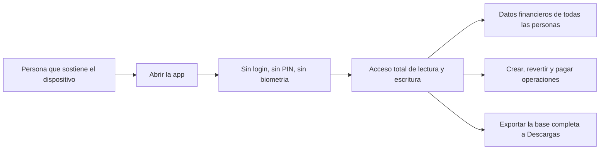

# 12 — Autenticación y autorización

## Conclusión

**Esta capacidad no fue encontrada en la implementación actual.**

La aplicación **no tiene autenticación ni autorización de ningún tipo**. Quien abre la app
tiene acceso total e inmediato a todos los datos y a todas las operaciones.

## Evidencia de la ausencia

| Elemento buscado | Resultado |
|---|---|
| Pantalla de login / registro | **No existe** |
| Recuperación de contraseña | **No existe** |
| Logout | **No existe** |
| Tabla de usuarios o credenciales | **No existe** (`persons` es un catálogo de negocio, no de acceso) |
| Columna de contraseña, hash o PIN | **Ninguna** en las 22 tablas |
| Tokens / JWT / refresh tokens | **No existen** |
| `flutter_secure_storage`, `shared_preferences`, Keychain, Keystore | **Sin dependencias** |
| Biometría (`local_auth`) | **Sin dependencia** |
| `redirect` o guardas en `GoRouter` | **Ninguna** (`lib/app.dart`) |
| Interceptores de autenticación | No aplica (no hay red) |
| Bloqueo por inactividad | **No existe** |
| Cifrado de la base de datos (`sqlcipher`, `sqflite_sqlcipher`) | **Sin dependencia**: la BD está en texto plano |

## Lo que sí existe: roles de negocio (que NO son autorización)

`persons.role` (`ADMIN` / `FAMILY` / `THIRD_PARTY`) es un atributo **de dominio**, no de
seguridad. No controla quién puede hacer qué; controla **cómo se le cobra a esa persona** y
**en qué selectores aparece**.

Efectos reales del rol, confirmados en el código:

| Rol | Efecto observable |
|---|---|
| `ADMIN` | Es el único que aparece en el selector de "pagador" al proveedor (`purchases_screen.dart`, `purchase_form_screen.dart`). Se **excluye** de la lista de liquidaciones (`settlements()` filtra `p.role<>'ADMIN'`), del formulario de aplicación y del de transferencia |
| `FAMILY` | Política por defecto `BY_ACTUAL_USAGE`: se le cobra al aplicar |
| `THIRD_PARTY` | Política por defecto `BY_PURCHASE_ALLOCATION`: se le cobra al comprar |

**Cualquiera que abra la app puede actuar en nombre de cualquier persona**, incluido
registrar un pago al proveedor eligiendo a cualquier `ADMIN` como pagador. No hay
verificación de identidad en ningún punto.

## Diagrama del modelo de acceso real

El único control de acceso efectivo es **físico**: el bloqueo de pantalla del dispositivo y
el aislamiento del sandbox de la aplicación (que impide a otras apps leer su base, salvo en
un dispositivo con root o jailbreak).

## Valoración del riesgo

Que esto sea aceptable depende enteramente del contexto de uso, que **el código no puede
determinar**:

| Escenario | Valoración |
|---|---|
| Un único dispositivo, en manos del administrador de la familia | **Riesgo bajo y aceptable.** Añadir login sería fricción sin beneficio |
| Dispositivo compartido entre varios familiares | **Riesgo medio.** Cualquiera puede alterar saldos ajenos sin traza de autoría |
| Dispositivo que sale del entorno familiar (pérdida, robo, préstamo) | **Riesgo alto.** Toda la contabilidad queda expuesta y es exportable |

`REQUIERE INFORMACIÓN DEL DESARROLLADOR`: no se puede determinar desde el repositorio si la
app se usa en un solo dispositivo controlado o en varios. Esa respuesta decide si la falta
de autenticación es una decisión correcta o una carencia.

Aunque no se añada login, hay dos mitigaciones de bajo coste registradas en
[29_IMPROVEMENT_AUDIT](29_IMPROVEMENT_AUDIT.md):

1. **Trazabilidad de autoría**: no se registra *quién* creó cada asiento. Añadir un campo de
   operador daría auditoría sin imponer autenticación.
2. **Bloqueo opcional por biometría o PIN al abrir**, activable por el usuario.

## Lo que no procede documentar

Refresh de tokens, expiración de sesión, almacenamiento seguro de credenciales, guardas de
ruta, interceptores 401/403, revocación, *single sign-on*, OAuth: **ninguno de estos
conceptos tiene implementación en el proyecto.**
