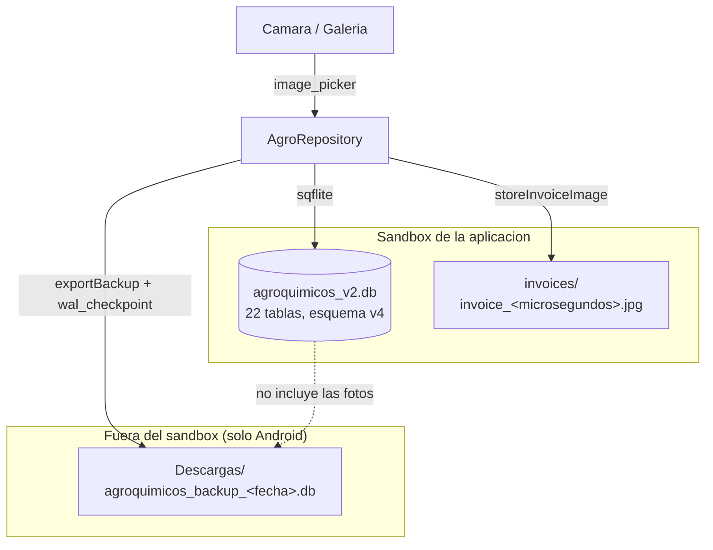

# 13 — Almacenamiento local

Todo el estado de la aplicación vive en el dispositivo. Hay exactamente **tres** mecanismos
de persistencia.

## Resumen

| Mecanismo | Qué guarda | Ubicación | Ciclo de vida |
|---|---|---|---|
| **SQLite** | Todo el modelo de negocio (22 tablas) | `agroquimicos_v2.db` | Permanente hasta desinstalar |
| **Archivos de imagen** | Fotos de facturas | `<documentos app>/invoices/` | Permanente hasta desinstalar; **nunca se limpian** |
| **Archivo de backup** | Copia del `.db` | Directorio Descargas (o Documentos) | Permanente; fuera del sandbox en Android |

**No se usa**: `SharedPreferences`, `DataStore`, `AsyncStorage`, Hive, Realm, CoreData,
Room, `flutter_secure_storage`, Keychain, Keystore, ni caché en memoria.

## 1. Base de datos SQLite

### Ubicación por plataforma

`AppDatabase._defaultPath()` (`lib/data/app_database.dart`):

| Plataforma | Ruta |
|---|---|
| Android / iOS | `<getDatabasesPath()>/agroquimicos_v2.db` — es decir `/data/data/com.comunidad.agro.agroquimicos/databases/` en Android |
| Windows / Linux / macOS | `<getApplicationSupportDirectory()>/agroquimicos_v2.db` (el directorio se crea con `create(recursive: true)`) |
| Tests | `inMemoryDatabasePath` (`:memory:`) o un archivo temporal |

### Elección del motor

`AppDatabase._platformFactory()`:

```dart
if (!kIsWeb && (Platform.isWindows || Platform.isLinux || Platform.isMacOS)) {
  sqfliteFfiInit();
  return databaseFactoryFfi;
}
return mobile.databaseFactory;
```

> **Limitación**: la rama `kIsWeb` cae en `mobile.databaseFactory`, que no funciona en
> navegador. Además, la simple evaluación de `Platform.isWindows` requiere `dart:io`, que
> no existe en web. La app **no es funcional en web**. Ver [01](01_PROJECT_OVERVIEW.md).

### Configuración de apertura

```dart
OpenDatabaseOptions(
  version: 4,
  onConfigure: (db) async => db.execute('PRAGMA foreign_keys = ON'),
  onCreate: (db, version) => _createSchema(db),
  onUpgrade: _upgradeSchema,
)
```

- **`PRAGMA foreign_keys = ON`** es una decisión correcta y poco frecuente: SQLite las
  desactiva por defecto. Garantiza que no queden referencias colgantes.
- **Apertura perezosa**: `Future<Database> get database async => _db ??= await _open()`.
  La BD se abre con la primera consulta, no al arrancar. Las migraciones corren ahí, de
  forma invisible para el usuario.
- **Sin `PRAGMA journal_mode`, `synchronous` ni `busy_timeout` explícitos**: se usan los
  valores por defecto. `exportBackup` ejecuta `PRAGMA wal_checkpoint(FULL)`, lo que sugiere
  que se asume modo WAL (que es el predeterminado de `sqflite` en Android).

### Qué se guarda y por qué

Detalle completo del esquema en [10_DATA_MODEL](10_DATA_MODEL.md). Resumen por naturaleza:

| Naturaleza | Tablas | Motivo de persistencia |
|---|---|---|
| Catálogos maestros | `persons`, `farms`, `campaigns`, `products`, `suppliers` | Datos de referencia; se archivan lógicamente, nunca se borran |
| Documentos comerciales | `purchases`, `purchase_items`, `purchase_allocations`, `provider_payments` | Evidencia de lo comprado y pagado, con precios históricos |
| Inventario | `inventory_lots`, `inventory_movements` | Libro mayor de existencias; el saldo es siempre derivado |
| Operaciones de campo | `applications`, `application_items`, `application_consumptions`, `application_plans`, `application_plan_items` | Trazabilidad de qué se aplicó, dónde y de qué lote salió |
| Contabilidad | `account_transactions`, `payment_allocations` | Libro de asientos inmutable |
| Movimientos internos | `transfers`, `transfer_items`, `transfer_lot_items` | Traslado de stock entre personas |
| Configuración | `app_settings` | **Nunca usada** |

### Vida útil y limpieza

**No hay ninguna rutina de limpieza, purga, archivado físico ni retención.**

- Nada se borra nunca: el archivado es lógico (`active = 0`, `status = 'CLOSED'`).
- Las reversiones **añaden** filas (movimientos compensatorios y asientos de crédito) en
  lugar de eliminar; la base solo crece.
- Cerrar una campaña **no** archiva ni comprime datos: solo cambia un `status`.

Consecuencia: el crecimiento es monótono. Con el volumen esperado de una familia
(cientos de operaciones al año) esto es perfectamente sostenible durante décadas. El test
`volume_test.dart` valida el comportamiento con 100 productos, 1 000 aplicaciones y
300 compras. Ver [25_PERFORMANCE_AUDIT](25_PERFORMANCE_AUDIT.md).

### Sincronización

Ninguna. Ver [14_OFFLINE_AND_SYNC](14_OFFLINE_AND_SYNC.md).

### Cierre

`AppDatabase.close()` se registra en `ref.onDispose(database.close)` del `databaseProvider`,
por lo que se cierra al destruirse el `ProviderScope`. En una app de una sola pantalla raíz
esto ocurre al terminar el proceso.

## 2. Imágenes de factura

`AgroRepository.storeInvoiceImage(sourcePath)`:

```
directorio = getApplicationDocumentsDirectory()
carpeta    = <directorio>/invoices/          (create recursive)
extensión  = p.extension(origen), o '.jpg' si no tiene
destino    = <carpeta>/invoice_<microsegundosDesdeEpoch><extensión>
File(origen).copy(destino)  →  devuelve la ruta absoluta
```

Esa ruta absoluta se guarda en `purchases.invoice_image_path`.

**Captura**: `ImagePicker().pickImage(source:, imageQuality: 82, maxWidth: 1800)` — la
compresión al 82 % y el ancho máximo de 1800 px acotan el tamaño de forma razonable.

**Lectura**: `PurchasesScreen._viewInvoice(path)` comprueba `await file.exists()` antes de
mostrar, y avisa si el archivo desapareció. Buena defensa.

### Problemas confirmados

| Problema | Detalle |
|---|---|
| **Ruta absoluta persistida** | En iOS, el UUID del contenedor de la app cambia entre reinstalaciones y algunas actualizaciones, invalidando todas las rutas guardadas. Lo correcto sería guardar la **ruta relativa** y recomponerla en tiempo de ejecución |
| **Sin limpieza** | Si se revierte una compra, la imagen **no se borra**. Los archivos se acumulan indefinidamente |
| **Sin huérfanos detectables** | Si se aborta el formulario después de `storeInvoiceImage` pero antes de `confirmPurchase`, la imagen queda copiada sin referencia en la base. `PurchaseFormScreen._confirm` copia la imagen **antes** de llamar a `confirmPurchase` |
| **Fuera del backup** | `exportBackup` copia solo el `.db`; las fotos quedan atrás |
| **Sin límite de espacio** | No se acota el número ni el tamaño total de imágenes |

Registrados en [26_TECHNICAL_DEBT](26_TECHNICAL_DEBT.md) y [27_KNOWN_ISSUES](27_KNOWN_ISSUES.md).

## 3. Archivo de backup

> **Actualizado en la fase de estabilizacion.** La exportacion, la validacion y la
> restauracion viven ahora en `lib/data/backup_service.dart` (`BackupService`), extraido de
> `AgroRepository`. Ver [33_STABILIZATION_FINDINGS](33_STABILIZATION_FINDINGS.md) STAB-007.

### Restauracion

`BackupService.restore(path)`:

1. **Valida** el archivo antes de tocar nada. Si no es valido, lanza `BackupException` y
   **no modifica la base actual**.
2. Cierra la base en uso.
3. **Guarda una copia de seguridad** de los datos actuales en `<base>.previo-<fecha>.db` y
   devuelve su ruta, de modo que una restauracion equivocada sigue siendo reversible.
4. Copia el respaldo sobre la base y elimina los diarios `-wal`/`-shm` de la base anterior,
   que pertenecian a otro archivo y la corromperian.
5. Reabre la base, lo que **dispara las migraciones** si el respaldo era de un esquema mas
   antiguo, y comprueba que resulte utilizable.
6. Si la copia falla a mitad, restituye la copia de seguridad.

### Validacion (`BackupService.validate`)

| Comprobacion | Rechaza si |
|---|---|
| Existencia | El archivo no existe |
| Tamano | El archivo esta vacio |
| `PRAGMA integrity_check` | La base esta truncada o danada |
| Tablas requeridas | Falta alguna de `persons`, `products`, `campaigns`, `purchases`, `inventory_lots`, `inventory_movements`, `account_transactions` - evita restaurar una base SQLite ajena |
| `PRAGMA user_version` | El respaldo procede de una version de la app **mas nueva** que la instalada |

Un respaldo de esquema **mas antiguo** si se acepta: se migra al restaurar.

### Seleccion del archivo

La interfaz no depende de un selector de archivos del sistema (no se anadio ninguna
dependencia). `BackupService.listAvailableBackups()` enumera los respaldos presentes en las
carpetas donde la propia app exporta, ordenados del mas reciente al mas antiguo, y el
usuario elige de esa lista.

### Acceso desde la interfaz

`/liquidacion` -> menu de copias de seguridad -> **Exportar backup** / **Restaurar backup**.
La restauracion muestra el nombre, la fecha, el tamano y la version de esquema, y exige una
confirmacion explicita que advierte de que se reemplazaran todos los datos.

### Limitacion conocida (sin resolver)

El respaldo sigue conteniendo **solo la base de datos**. Las fotografias de factura
(`<documentos>/invoices/`) **no se incluyen**, por lo que tras restaurar en otro dispositivo
las rutas de imagen apuntaran a archivos inexistentes. La app lo detecta y muestra
*"La imagen de factura ya no esta disponible en este dispositivo."*

## 3.1. Detalle del archivo exportado

`AgroRepository.exportBackup()`:

```
PRAGMA wal_checkpoint(FULL)                     // vuelca el WAL al archivo principal
origen = appDatabase.openedPath                 // falla si es null o ':memory:'
destino = getDownloadsDirectory() ?? getApplicationDocumentsDirectory()
nombre  = agroquimicos_backup_<ISO8601 con ':' → '-'>.db
File(origen).copy(destino)  →  snackbar con la ruta
```

| Aspecto | Estado |
|---|---|
| Cifrado | **Ninguno** — SQLite en texto plano |
| Ubicación en Android | Descargas: **fuera del sandbox**, legible por otras apps con permiso de almacenamiento |
| Incluye fotos | **No** |
| Restauración desde la app | ✅ **Sí** (`BackupService.restore`, con validación y copia previa) |
| Verificación de integridad | ✅ `PRAGMA integrity_check` + tablas requeridas + versión de esquema |
| Automatización | **Ninguna**; es manual |

El uso de `wal_checkpoint(FULL)` antes de copiar es correcto y evita el error clásico de
copiar un `.db` sin sus `-wal`/`-shm`. Buen detalle.

## Diagrama del almacenamiento



## Riesgos identificados

| Riesgo | Severidad | Detalle |
|---|---|---|
| **Punto único de fallo** | **Crítico** (operativo) | Toda la contabilidad en un archivo, en un dispositivo, sin respaldo automático |
| Base de datos sin cifrar | Medio | Accesible con root/jailbreak o mediante backup de ADB si `allowBackup` no está desactivado |
| Backup sin cifrar en Descargas | Medio | Legible por otras aplicaciones en Android |
| Sin restauración | Alto | Tener un backup no sirve si la app no lo puede leer |
| Rutas absolutas de imágenes | Medio | Se rompen tras reinstalar en iOS |
| Crecimiento sin límite de `invoices/` | Bajo | Ocupación de espacio a largo plazo |
| Sin `android:allowBackup="false"` | Bajo | El manifiesto no lo declara, por lo que se aplica el valor por defecto de la plataforma. Ver [23](23_SECURITY_AUDIT.md) |

---

# Actualización 2026-09-06 — Respaldo 2.0: la base **y** las fotografías

Este documento describía una limitación deliberada: el respaldo contenía sólo la base de
datos, y las fotografías de factura, que viven en `<documentos>/invoices/`, quedaban fuera.
**Esa limitación queda cerrada.**

## Formato del contenedor

`agroquimicos_backup_<fecha>.agrobackup` es un **ZIP corriente** —no un formato binario
inventado— con esta estructura:

```
manifest.json
database.db
invoices/
  invoice_<microsegundos>.<ext>
  ...
```

Dependencias: `archive` (nueva, directa) y `crypto` (ya era transitiva; se promueve a directa
sólo para los checksums). No se añadió nada más.

## Manifiesto

```json
{
  "backupFormatVersion": 1,
  "application": "agrocuentas",
  "appVersion": "1.0.0",
  "databaseSchemaVersion": 6,
  "createdAt": "2026-09-06T00:14:11.288837",
  "database": { "name": "database.db", "bytes": 196608, "sha256": "..." },
  "attachmentCount": 1,
  "attachments": [
    { "name": "invoice_ui_audit.png", "bytes": 5849, "sha256": "...", "purchaseIds": [1, 9] }
  ],
  "missingAttachments": []
}
```

`backupFormatVersion` es **independiente** de la versión de esquema SQLite: describe la forma
del paquete, no su contenido. **Nunca guarda secretos.**

## Qué fotografías entran

Sólo las **realmente referenciadas** por alguna compra (`purchases.invoice_image_path`). Las
huérfanas del disco no viajan.

Si una referenciada **ya no existe** en el teléfono, el respaldo **se completa igualmente** y
la pérdida se declara: entra en `missingAttachments` y la aplicación la avisa por pantalla.
La decisión está razonada: bloquear el respaldo por una foto perdida dejaría al usuario sin
copia de sus cuentas, que es peor. Lo que no se hace nunca es ocultarlo.

## Rutas absolutas y su reconstrucción

`purchases.invoice_image_path` guarda una **ruta absoluta** del dispositivo donde se tomó la
foto, por ejemplo
`/data/user/0/com.comunidad.agro.agroquimicos/app_flutter/invoices/invoice_123.jpg`.

Restaurar en otro teléfono —o tras reinstalar, porque la carpeta de datos cambia— dejaría esas
rutas apuntando a un directorio inexistente. Al restaurar, cada compra se **reapunta** a la
carpeta local de facturas **por nombre de archivo**, y sólo para las fotos que el respaldo
traía. Es una reconstrucción acotada, no una migración global de rutas: una foto que el
respaldo no incluía conserva su valor original y se avisa de que falta.

La carpeta la decide un único sitio, `lib/data/invoice_storage.dart`, que usan tanto
`AgroRepository.storeInvoiceImage` como `BackupService`. Antes cada uno la calculaba por su
cuenta y bastaba con que uno cambiara para que el respaldo dejara de encontrar los archivos.

## Secuencia de exportación

1. consolidar la base (checkpoint WAL con `rawQuery`, ver UIBUG-001);
2. carpeta temporal;
3. copiar la base y **validarla ya copiada** — si no es legible, no se sigue;
4. reunir las fotografías referenciadas, con tamaño y `sha256`;
5. escribir el manifiesto;
6. empaquetar **dentro de la carpeta temporal**, para que el destino nunca vea un archivo a
   medio escribir con nombre de respaldo;
7. **volver a validar el paquete escrito** con la misma validación que usa la restauración;
8. mover al destino definitivo.

## Secuencia de restauración

validar, extraer a carpeta temporal, validar manifiesto, `integrity_check`, validar esquema,
validar fotografías (presencia y `sha256`), **copia de seguridad de la base Y de las
fotografías actuales**, cerrar la base, sustituir, reubicar fotografías, reabrir (lo que
dispara las migraciones si el respaldo era más antiguo), reapuntar rutas y comprobación
posterior.

**Ante cualquier fallo se deshace el conjunto.** Nunca queda una base nueva con las fotos
viejas ni al revés. Está probado forzando un fallo a mitad de la copia de fotografías
(`backup_container_test.dart`).

## Compatibilidad hacia atrás

Los respaldos `.db` de versiones anteriores **se siguen validando y restaurando**. Se
reconocen **por su contenido** (los dos primeros bytes: `PK` significa contenedor), no por su
extensión, y la aplicación avisa antes de aceptar que el formato histórico no trae fotografías
y que las del teléfono se conservan.

El listado de respaldos ofrece los dos formatos. Verificado en el Pixel 8 restaurando un `.db`
de esquema v5, que además ejercitó la migración v5 a v6 al reabrir.

## Dónde se escribe

`getDownloadsDirectory()` y, si no existe, el directorio de documentos de la aplicación. En
Android eso resuelve a `Android/data/<paquete>/files/Download`.

**Limitación aceptada:** el archivo sobrevive a un borrado de datos de la aplicación pero
**no a desinstalarla**. Para conservarlo hay que copiarlo fuera del teléfono. Compartirlo con
el selector del sistema es evolución diferida ([`46` seccion 16](46_BASELINE_FINAL_FREEZE.md)).

## Cobertura

`backup_container_test.dart` (27 tests) cubre: contenedor sin fotos, con una y con varias;
nombres de archivo; foto ausente al exportar; archivo que no es ZIP ni base; contenedor sin
manifiesto; manifiesto ilegible o de otra aplicación; contenedor sin base; base dañada; foto
anunciada pero ausente; foto alterada (detectada por `sha256`); formato de contenedor futuro;
esquema futuro; respaldo `.db` legado; ciclo completo con reapertura de la foto; restauración
en otra carpeta; copia de seguridad previa; rollback a mitad; integridad posterior; y
restaurar dos veces seguidas.

Más `backup_service_test.dart` y `backup_android_semantics_test.dart`, que se conservan.
