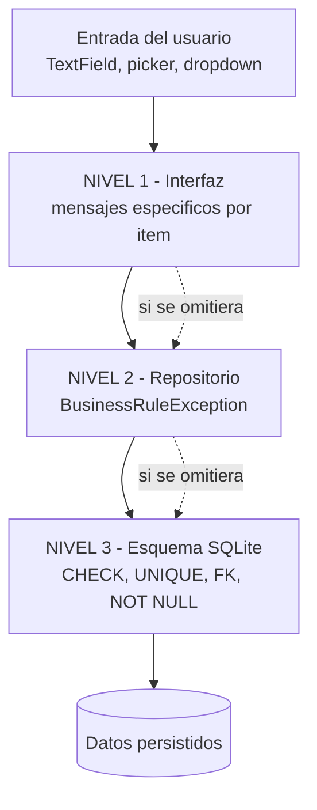

# 16 — Validaciones

Complementa a [15_BUSINESS_RULES](15_BUSINESS_RULES.md). Aquí se clasifica **dónde** se
valida cada cosa y se identifican los huecos.

## Los tres niveles de validación del proyecto



El proyecto usa **defensa en profundidad** de forma bastante consistente: las reglas
importantes están en al menos dos niveles.

## Parseo de entrada: tolerante por diseño

`lib/presentation/widgets/common.dart` define el punto único de conversión texto → número:

```dart
num? tryParseDecimal(String value) {
  final normalized = value.trim().replaceAll(' ', '').replaceAll(',', '.');
  if (normalized.isEmpty) return null;
  return num.tryParse(normalized);
}

int? tryParseMinor(String v) => tryParseDecimal(v) == null ? null : (… * 100).round();
int? tryParseBase(String v)  => tryParseDecimal(v) == null ? null : (… * 1000).round();
int parseMinor(String v) => tryParseMinor(v) ?? 0;
int parseBase(String v)  => tryParseBase(v)  ?? 0;
```

**Decisiones acertadas:**
- Acepta **coma decimal** (`1,5` → `1.5`), imprescindible en localización boliviana.
- Elimina espacios (tolera `1 500`).
- Usa `tryParse`, no `parse`: **nunca lanza `FormatException`**. Existe un test de regresión
  dedicado: *"editar y vaciar cantidad de compra no lanza FormatException"*.

**Consecuencia a tener presente:** un texto inválido (`"abc"`) o vacío se convierte
silenciosamente en **`0`** cuando se usa `parseMinor`/`parseBase`. No se distingue "el
usuario no escribió nada" de "el usuario escribió algo sin sentido". Las validaciones
posteriores de "> 0" atrapan ambos casos, pero el mensaje al usuario es genérico.

**Sin `TextInputFormatter`**: ningún campo restringe los caracteres que se pueden teclear.
Solo se sugiere el teclado con `keyboardType: TextInputType.numberWithOptions(decimal: true)`.

## Tabla maestra de validaciones

Leyenda: 🟢 validado · 🔵 solo interfaz · 🟡 hueco identificado · ⬜ no aplica

| Dato | Interfaz | Repositorio | Esquema | Veredicto |
|---|:--:|:--:|:--:|---|
| **Compras** | | | | |
| Proveedor seleccionado | 🟢 | ⬜ | 🟢 FK NOT NULL | Cubierto |
| Campaña seleccionada y activa | 🟢 | 🟢 RN-13 | 🟢 FK | Bien cubierto |
| Al menos un producto | 🟢 | 🟢 RN-04 | ⬜ | Cubierto |
| Producto seleccionado por línea | 🟢 | ⬜ | 🟢 FK NOT NULL | Cubierto |
| Cantidad > 0 | 🟢 | 🟢 RN-06 | ⬜ | Bien cubierto |
| Precio > 0 | 🟢 | 🟢 RN-06 | ⬜ | Bien cubierto |
| TC obligatorio si USD | 🟢 | 🟢 RN-07 | ⬜ | Bien cubierto |
| TC prohibido si BOB | 🔵 implícito | 🟢 RN-07 | ⬜ | Cubierto por repositorio |
| Productos no repetidos | 🟢 filtra el selector | 🟢 RN-05 | ⬜ | Bien cubierto |
| Persona en cada asignación | 🟢 | ⬜ | 🟢 FK NOT NULL | Cubierto |
| Suma asignada = cantidad | 🟢 con mensaje según signo | 🟢 RN-08 | ⬜ | **Excelente** |
| Persona no repetida en una línea | 🟡 | 🟡 | 🟡 | **Hueco**: se puede asignar dos veces a la misma persona en la misma línea; genera dos lotes separados. No es incorrecto contablemente, pero es confuso |
| Pagador seleccionado si hay pago | 🟢 | ⬜ | 🟢 FK | Cubierto |
| **Pagos a proveedor** | | | | |
| Importe > 0 | 🔵 el diálogo precarga el máximo | 🟢 RN-16 | 🟢 `CHECK(> 0)` | **Triple cobertura** |
| Importe ≤ saldo | 🔵 solo `helperText` "Máximo …" | 🟢 RN-16 | ⬜ | Cubierto por repositorio |
| Compra no revertida | ⬜ el menú se oculta | 🟢 | ⬜ | Cubierto |
| Pagador es ADMIN | 🟢 filtra la lista | 🟡 | 🟡 | **Hueco menor**: el repositorio aceptaría cualquier `person_id`. Inalcanzable desde la UI |
| **Planes** | | | | |
| Chaco seleccionado | 🟢 | ⬜ | 🟢 FK | Cubierto |
| Área > 0 | 🟡 | 🟢 RN-17 | ⬜ | Solo repositorio; la UI dejaría enviar área vacía (→ 0) y el mensaje sería el genérico del repositorio |
| Al menos un producto | 🟢 | 🟢 RN-17 | ⬜ | Cubierto |
| Dosis > 0 | 🟢 | 🟢 RN-19 | ⬜ | Bien cubierto |
| Productos no repetidos | 🟢 filtra + avisa | 🟢 RN-18 | 🟢 UNIQUE* | Bien cubierto (*solo en instalaciones nuevas) |
| **Aplicaciones** | | | | |
| Persona seleccionada | 🟢 | ⬜ | 🟢 FK | Cubierto |
| Chaco seleccionado | 🟢 | ⬜ | 🟢 FK | Cubierto |
| Chaco pertenece a la persona | 🟢 filtra la lista y auto-cambia la persona | 🟡 | 🟡 | **Hueco**: `confirmApplication` no comprueba que `farm.owner_person_id == person_id` |
| Al menos un producto | 🟢 | 🟢 RN-22 | ⬜ | Cubierto |
| Cantidad real > 0 | 🟢 | 🟢 RN-24 | ⬜ | Bien cubierto |
| Cantidad ≤ stock | 🟢 con "stock después" en vivo | 🟢 RN-25 | ⬜ | **Excelente** |
| Productos no repetidos | 🟢 filtra + avisa | 🟢 RN-23 | 🟢 UNIQUE* | Bien cubierto |
| Área tratada > 0 | 🟡 | 🟡 | 🟡 | **Hueco**: se puede confirmar con área 0; el teórico sale 0 y la varianza queda igual a la cantidad real |
| Dosis > 0 | 🟡 | 🟡 | ⬜ | **Hueco**: la dosis es opcional en una aplicación (a diferencia del plan) |
| Plan de la campaña activa | 🟢 RN-29 | 🟡 | ⬜ | **Solo interfaz** |
| **Transferencias** | | | | |
| Origen ≠ destino | 🟢 excluye del selector | 🟢 RN-30 | 🟢 `CHECK` | **Triple cobertura** |
| Al menos una cantidad > 0 | 🟢 | 🟢 RN-31 | 🟢 `CHECK(> 0)` | **Triple cobertura** |
| Cantidad ≤ stock | 🟢 | 🟢 RN-33 | ⬜ | Bien cubierto |
| Productos no repetidos | ⬜ un campo por producto | 🟢 RN-32 | 🟢 UNIQUE | Bien cubierto |
| **Cuentas** | | | | |
| Importe > 0 | 🟡 | 🟢 RN-36 | ⬜ | Solo repositorio |
| Importe ≤ deuda | 🟡 | 🟡 | ⬜ | **Sin límite por diseño**: permite saldo a favor. Ver abajo |
| **Catálogos** | | | | |
| Nombre no vacío | 🟢 el botón no cierra el diálogo | 🟢 en `renameCatalog` | ⬜ | Cubierto |
| Nombre no vacío al crear | 🟢 | 🟡 solo `.trim()` | ⬜ | **Hueco menor**: `addPerson`/`addSupplier`/`addProduct` no rechazan cadena vacía |
| Superficie > 0 | 🟡 | 🟡 | 🟢 `CHECK(area_m2 > 0)` | Cubierto por esquema, pero el error que ve el usuario es una excepción SQLite cruda, no un mensaje de negocio |
| Rol válido | 🟢 dropdown cerrado | 🟢 enum | 🟢 `CHECK` | **Triple cobertura** |
| Unidad válida | 🟢 `SegmentedButton` | ⬜ | 🟢 `CHECK` | Cubierto |
| **Campañas** | | | | |
| Solo una activa | ⬜ | 🟢 RN-11 | 🟢 UNIQUE parcial | **Excelente** |
| No activar archivada | ⬜ | 🟢 RN-12 | ⬜ | Regla sobre estado inalcanzable |
| Solo cerrar la activa | 🟢 el menú lo condiciona | 🟢 RN-14 | ⬜ | Bien cubierto |

## Huecos de validación, ordenados por riesgo

### 🟡 H-01 · Chaco de otra persona (riesgo: datos incoherentes)
`confirmApplication` no verifica que `farms.owner_person_id == draft.personId`. La UI lo
impide filtrando la lista y auto-cambiando la persona, pero la regla no existe en el
repositorio. Un cambio futuro en la pantalla podría producir aplicaciones donde una persona
fumiga el chaco de otra, algo que el modelo de costos no contempla.
**Coste de corregir**: bajo (una consulta dentro de la transacción).

### 🟡 H-02 · Plan de otra campaña (riesgo: datos incoherentes)
RN-29 vive solo en `ApplicationFormScreen`. `confirmApplication` marcaría como `COMPLETED`
un plan de una campaña cerrada.
**Coste de corregir**: bajo.

### 🟡 H-03 · Área tratada en cero (riesgo: métricas sin sentido)
Se puede confirmar una aplicación con el campo de área vacío. Consecuencias:
- `theoretical_quantity_base = 0`
- `variance_quantity_base = cantidad real` (varianza del 100 %)
- `farmCostReport` sigue funcionando porque usa `farms.area_m2`, no la tratada.
No corrompe dinero, pero ensucia los indicadores de teórico vs real.

### 🟡 H-04 · Pagos sin tope (riesgo: bajo; probablemente intencional)
`addAccountPayment` no compara el importe con la deuda. Permite registrar un pago de
Bs 1 000 000 a quien debe Bs 100. El resultado es un saldo a favor de Bs 999 900, que la UI
muestra correctamente en verde como "Saldo a favor".

Esto **parece deliberado**: los adelantos requieren exactamente esta capacidad (pagar antes
de que exista la deuda). La mejora recomendable no es prohibirlo, sino **avisar**: un
diálogo de confirmación cuando el importe supera la deuda actual.

Contraste llamativo: el pago **al proveedor** sí tiene tope estricto (RN-16). La asimetría
es coherente con el dominio, pero conviene documentarla para que nadie la "corrija" por error.

### 🟡 H-05 · Persona duplicada dentro de una línea de compra
Nada impide asignar dos veces a la misma persona en el mismo producto. El resultado son
dos `purchase_allocations` y **dos lotes** con el mismo costo y fecha. Contablemente da lo
mismo (la suma sigue cuadrando con RN-08 y el FIFO los consume seguidos), pero fragmenta el
inventario sin motivo y confunde en la pantalla de lotes.

### 🟡 H-06 · Nombres vacíos en las altas de catálogo
`addPerson`, `addSupplier`, `addProduct` y `addFarm` hacen `.trim()` pero no rechazan la
cadena vacía; solo `renameCatalog` lo hace. La UI lo previene en los cuatro diálogos, así
que hoy es inalcanzable.

### 🟡 H-07 · Superficie inválida produce un error técnico
Si el usuario escribe texto no numérico en "Superficie (ha)", `tryParseDecimal` devuelve
`null`, se envía `0`, y el `CHECK(area_m2 > 0)` de SQLite lanza una `DatabaseException`. El
usuario ve el mensaje crudo de SQLite en un snackbar, no un texto de negocio.
Mismo patrón en el área de un plan (aunque ahí sí hay mensaje de negocio en RN-17).

## Calidad de los mensajes de error

Los mensajes de validación de este proyecto son, en general, **de calidad notablemente alta
para un proyecto de este tamaño**. Ejemplos:

| Mensaje | Por qué es bueno |
|---|---|
| *"Complete producto, cantidad y precio del ítem 3."* | Identifica la línea concreta |
| *"La suma asignada supera la cantidad comprada en el ítem 2."* vs *"Falta asignar parte de la cantidad del ítem 2."* | **Dos mensajes distintos según el signo del error** |
| *"Stock insuficiente en uno de los productos. No se transfirió ningún item."* | Explica la consecuencia (atomicidad), no solo el error |
| *"La compra tiene lotes consumidos. Revierta primero las aplicaciones relacionadas."* | Indica **la acción correctiva** |
| *"Está activa Verano 2026. Cierre esa campaña antes de activar otra."* | Nombra la entidad en conflicto (gracias a `CampaignConflictException`) |
| *"La imagen de factura ya no está disponible en este dispositivo."* | Diagnóstico preciso, sin culpar al usuario |

Todos están en español, en tono neutro y orientados a la acción. Es un punto fuerte real
del producto.

## Traducción de errores a lenguaje de usuario

`friendlyError` (`common.dart`) es el único traductor:

```dart
String friendlyError(Object error) {
  final message = error.toString().replaceFirst('BusinessRuleException: ', '');
  if (message.contains('FormatException')) return 'Revise los valores numéricos ingresados.';
  if (message.contains('StateError'))      return 'Falta seleccionar información requerida.';
  return message;
}
```

**Cubre**: `BusinessRuleException` (quita el prefijo), `FormatException`, `StateError`.

**No cubre**: `DatabaseException` de SQLite (violaciones de `CHECK`, `UNIQUE`, `FK`),
`TypeError` de casts fallidos, ni ninguna otra excepción. En esos casos el usuario ve el
`toString()` técnico completo. Ver [17_ERROR_HANDLING](17_ERROR_HANDLING.md).

**Uso inconsistente**: `CatalogsScreen` y `PurchasesScreen` muestran
`snapshot.error.toString()` **sin** pasar por `friendlyError`, a diferencia de las otras
nueve pantallas. Registrado en [27_KNOWN_ISSUES](27_KNOWN_ISSUES.md).

---

# Actualización 2026-09-06 — Validación visible en los catálogos y en las líneas de compra

## Diálogos de catálogo (UIBUG-031)

Los cuatro diálogos de `catalogs_screen.dart` (`_NameDialog`, `_PersonDialog`, `_FarmDialog`,
`_ProductDialog`) validaban con un `if` silencioso: si el campo estaba vacío, "Guardar" **no
hacía nada**. Ni guardaba, ni cerraba, ni explicaba. El botón parecía averiado.

Ahora cada uno es un `Form` con `validator`, así que el error aparece **en línea bajo el campo
que falta**, con el campo marcado, y sigue sin escribirse nada en la base:

| Diálogo | Qué exige |
|---|---|
| Nombre (proveedor, campaña, renombrar) | nombre no vacío |
| Persona | nombre no vacío |
| Chaco | propietario elegido · nombre no vacío · superficie no vacía, numérica y **mayor que cero** |
| Producto | nombre no vacío. El ingrediente activo **no** se valida: es opcional en el esquema, y exigirlo inventaría una regla que la base no tiene |

La superficie del chaco merece mención aparte: `farms.area_m2` tiene un `CHECK(area_m2 > 0)`,
así que un valor cero o no numérico llegaba como **excepción de SQLite** en vez de como aviso
del formulario. Ahora se valida donde se escribe.

## Estado de una línea de compra (UIBUG-039)

La tarjeta rotulaba "asignado" en cuanto la diferencia entre comprado y repartido era cero — y
eso es cierto también cuando **no se ha escrito nada**: cero comprado y cero repartido dan
diferencia cero. Una línea vacía se anunciaba como terminada.

Una asignación sólo está completa cuando existen **todos** sus datos obligatorios. La tarjeta
declara ahora cuál falta:

| Condición | Qué dice |
|---|---|
| cantidad comprada <= 0 | `Pendiente de cantidad` |
| alguna asignación sin persona | `Pendiente de persona` |
| suma repartida < comprada | `Pendiente <cantidad>` |
| suma repartida > comprada | `Excede en <cantidad>` |
| todo completo y cuadrado | `Asignado` |

**La regla contable no cambió**: `_confirm` valida exactamente lo mismo que antes. Lo que
cambió es lo que la tarjeta afirma mientras se rellena.

## Plan (UIBUG-032, verificado en dispositivo)

Los tres casos dan mensajes distintos, comprobado en el Pixel 8: sin chaco ni productos,
*"Seleccione el chaco y agregue al menos un producto."*; con chaco y sin productos, *"Agregue
al menos un producto al plan."*
