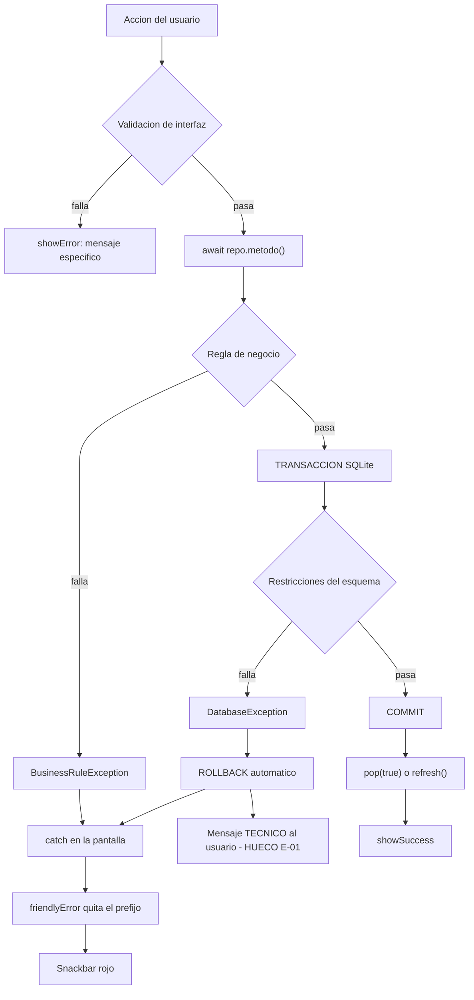

# 17 — Manejo de estados y errores

## Estrategia global: no existe

**No hay un manejador central de errores.** Verificado por ausencia de:

- `FlutterError.onError`
- `PlatformDispatcher.instance.onError`
- `runZonedGuarded`
- `ErrorWidget.builder` personalizado
- Cualquier servicio de *crash reporting*

Cada pantalla maneja sus propios errores con dos herramientas compartidas de
`lib/presentation/widgets/common.dart`. Es un patrón **consistente**, aunque descentralizado.

**Consecuencia**: cualquier excepción no capturada dentro de un `build()` muestra la
pantalla roja de error de Flutter en debug y una pantalla gris en release, sin registro ni
reporte. Nadie se entera de que ocurrió.

## Las dos herramientas compartidas

### 1. Errores en el `Future` → estado de pantalla

```dart
if (snapshot.hasError)
  return EmptyState(icon: Icons.error_outline, message: friendlyError(snapshot.error!));
```

Convierte el error en contenido de la pantalla, con icono y mensaje. Es el patrón dominante.

### 2. Errores en una acción → snackbar

```dart
void showError(BuildContext context, Object error) {
  ScaffoldMessenger.of(context).showSnackBar(SnackBar(
    content: Text(friendlyError(error)),
    backgroundColor: Theme.of(context).colorScheme.error,
  ));
}
```

Con su contraparte `showSuccess`, que usa un snackbar neutro.

## Taxonomía de errores y su tratamiento real

| Tipo de error | ¿Se produce? | Tratamiento | Calidad |
|---|---|---|---|
| **Validación de interfaz** | Sí | `showError` con mensaje específico por ítem | 🟢 Excelente |
| **Regla de negocio** (`BusinessRuleException`) | Sí | `friendlyError` quita el prefijo → mensaje limpio en español | 🟢 Excelente |
| **Conflicto de campaña** (`CampaignConflictException`) | Sí | **Capturada por tipo** en `CatalogsScreen._campaignAction` → diálogo con opción "Cerrar y activar" | 🟢 Ejemplar: el único error que ofrece una salida |
| **Parseo numérico** | Prevenido | `tryParse*` nunca lanza; devuelve 0 | 🟢 Bien resuelto |
| **`FormatException`** | Raro | `friendlyError` → *"Revise los valores numéricos ingresados."* | 🟢 Cubierto |
| **`StateError`** | Raro | `friendlyError` → *"Falta seleccionar información requerida."* | 🟢 Cubierto |
| **Archivo de factura ausente** | Sí | `_viewInvoice` comprueba `exists()` → mensaje propio | 🟢 Bien resuelto |
| **Error del selector de imágenes** | Sí | `try/catch` → *"No se pudo adjuntar la factura. Revise los permisos."* | 🟢 Bien resuelto |
| **`DatabaseException` de SQLite** | Posible | ❌ **Sin traducción**: el usuario ve el mensaje técnico crudo | 🔴 Hueco |
| **`TypeError` por cast fallido** | Posible | ❌ Sin captura: pantalla de error de Flutter | 🔴 Hueco |
| **`FormatException` de `int.parse` en rutas** | Posible | ❌ Sin captura: ocurre al construir la ruta | 🔴 Hueco |
| **Error de apertura de la BD** | Posible | Se propaga al primer `FutureBuilder`, que lo muestra como estado de error | 🟡 Aceptable |
| **Errores de red** | ⬜ | No aplica: no hay red | ⬜ |
| **Timeouts** | ⬜ | No aplica | ⬜ |
| **Errores de autenticación** | ⬜ | No aplica: no hay autenticación | ⬜ |

## Huecos concretos

### 🔴 E-01 · `DatabaseException` sin traducir

Las violaciones de `CHECK`, `UNIQUE` o clave foránea llegan al usuario en crudo. Ejemplo
reproducible: crear un chaco con superficie no numérica → `tryParseDecimal` devuelve `null`
→ se envía `areaM2: 0` → `CHECK(area_m2 > 0)` falla → el usuario ve algo similar a:

```
DatabaseException(CHECK constraint failed: area_m2 > 0) sql 'INSERT INTO farms ...'
```

`friendlyError` no contempla este tipo. **Corrección de bajo coste**: añadir una rama que
detecte `CHECK constraint failed`, `UNIQUE constraint failed` y `FOREIGN KEY constraint
failed` y devuelva mensajes de negocio.

### 🔴 E-02 · Casts sin protección en la capa de presentación

El patrón `row['columna'] as int` aparece **decenas de veces** en las pantallas. Si una
columna llega `null` (por ejemplo, un `LEFT JOIN` sin coincidencia) o con otro tipo, se
produce un `TypeError` **durante el `build`**, que no lo captura ningún `try/catch`.

Ejemplos localizados donde el cast no está protegido:

- `farm_logbook_screen.dart`: `row['quantity_base'] as int`, `row['unit'] as String`
  (aunque `treated_area_m2` y `dose_base_per_ha` sí usan `as int? ?? 0`)
- `persons_screen.dart`: `row['area_m2'] as int`, `row['balance'] as int`
- `settlements_screen.dart`: `row['balance']! as int`, `row['area_m2']! as int`
- `dashboard_screen.dart`: `row['available_value_bob_minor']! as int`

En la práctica, las consultas usan `COALESCE(..., 0)` de forma bastante disciplinada, lo que
evita casi todos los `null`. Pero la protección es **por convención en SQL**, no por tipos.
Ver [24_CODE_QUALITY_AUDIT](24_CODE_QUALITY_AUDIT.md).

### 🔴 E-03 · `int.parse` en parámetros de ruta

```dart
GoRoute(path: '/inventario/:id',
  builder: (_, state) => InventoryDetailScreen(
    productId: int.parse(state.pathParameters['id']!)));
```

Idéntico en `/personas/:id` y `/chacos/:id`. Una ruta con id no numérico lanza
`FormatException` durante la construcción. Solo alcanzable por deep link o navegación
programática errónea; hoy todas las llamadas pasan enteros. Nótese el contraste con
`/aplicaciones/nueva`, que **sí** usa `int.tryParse` para `planId`.

### 🔴 E-04 · Pantallas sin rama de error

| Pantalla | Problema |
|---|---|
| `SettlementsScreen` | **No tiene `if (snapshot.hasError)`**. Comprueba `!snapshot.hasData` y muestra el spinner; ante un error se queda **cargando indefinidamente** |
| `PurchasesScreen` | Tiene la rama de error, pero **después** de `!snapshot.hasData`. Como en un error `hasData` es falso, la rama de error **es inalcanzable** y el resultado es el mismo spinner infinito |

Ambas son el mismo defecto con distinta causa. Corrección trivial: comprobar `hasError`
antes que `hasData`.

### 🟡 E-05 · Uso inconsistente de `friendlyError`

| Pantalla | Qué muestra |
|---|---|
| Dashboard, Planning, PlanForm, Applications, ApplicationForm, Inventory, InventoryDetail, Persons, PersonDetail, FarmLogbook, Transfers, TransferForm | `friendlyError(snapshot.error!)` ✅ |
| `CatalogsScreen` | `snapshot.error.toString()` ❌ |
| `PurchasesScreen` | `snapshot.error.toString()` ❌ |

Dos de trece. En esas dos, un `BusinessRuleException` se mostraría con el prefijo
`BusinessRuleException: ` incluido.

### 🟡 E-06 · Excepciones silenciadas

Dos bloques `catch` vacíos:

```dart
// purchases_screen.dart, dentro de _PurchaseDialogState._submit  (CÓDIGO MUERTO)
} catch (_) {}

// settlements_screen.dart, dentro del diálogo de importe
FilledButton(onPressed: () {
  try { Navigator.pop(context, parseMinor(amount.text)); } catch (_) {}
```

El primero está en código inalcanzable. El segundo es inofensivo porque `parseMinor` no
lanza, pero enmascara cualquier fallo futuro de `Navigator.pop`.

### 🟡 E-07 · Rollback parcial en compra con pago

`PurchaseFormScreen._confirm` ejecuta dos operaciones en secuencia:

```dart
final purchaseId = await repo.confirmPurchase(draft);   // transacción 1
if (payProvider) {
  await repo.addProviderPayment(...);                   // transacción 2, SEPARADA
}
```

Si la segunda falla (por ejemplo, si el total calculado en la UI difiere del calculado por
el repositorio y dispara RN-16), la compra **queda creada sin su pago** y el usuario ve un
error, pudiendo pensar que nada se guardó. El formulario ni siquiera hace `pop`, porque el
`catch` está antes.

**Impacto real bajo** (el total lo calcula la misma fórmula en ambos lados), pero es una
inconsistencia transaccional genuina.

## Estados de interfaz

### Estado *loading*

Patrón único en las 13 pantallas con datos:

```dart
if (!snapshot.hasData) return const Center(child: CircularProgressIndicator());
```

Variantes localizadas:
- Spinner de 16 px dentro del botón "Confirmar" mientras `saving` (`PurchaseFormScreen`)
- Spinner de 20 px junto al título "Productos" mientras `loadingStock` (`ApplicationFormScreen`)
- `LinearProgressIndicator` mientras `loadingProducts` (`TransferFormScreen`)
- Spinner en el `prefixIcon` del `AdaptiveEntityPicker` cuando `loading: true`
- Texto del botón que cambia a "Guardando…" (`ApplicationFormScreen`)

**No hay** *skeletons*, *shimmer* ni indicadores de progreso determinado.

### Estado *empty*

`EmptyState` (icono + mensaje centrado) con textos específicos por contexto:

| Pantalla | Mensaje |
|---|---|
| Dashboard | "Aún no hay inventario." |
| Catalogs | "No hay registros. Usa Agregar para comenzar." |
| Planning | "No hay planes para mostrar." |
| PlanForm | "Agregue los productos de la planificación." |
| Purchases | "No hay compras confirmadas." |
| Applications | "No hay aplicaciones para mostrar." |
| ApplicationForm | "Agregue los productos de la mezcla." |
| Settlements | "Registra familiares o terceros para ver su liquidación." |
| Inventory | "No hay productos para mostrar." |
| PersonDetail | "Sin registros." |
| FarmLogbook | "Todavía no hay aplicaciones en este chaco." |
| Transfers | "No hay transferencias." |
| TransferForm | "Esta persona no tiene stock disponible." |
| Picker | "Sin resultados." / "No hay opciones disponibles." |

Textos concretos y contextualizados: **buen trabajo**.

**Huecos**: `PersonsScreen` no tiene estado vacío (renderiza una `Card` vacía);
`InventoryDetailScreen` renderiza listas vacías de distribución y lotes sin mensaje;
`DashboardScreen` no lo tiene en "Aplicaciones recientes" ni en "Principales saldos".

### Estado *success*

- Snackbar neutro: *"Compra multiproducto confirmada; lotes e inventario creados."*,
  *"Aplicación multiproducto confirmada."*, *"Backup guardado en `<ruta>`"*
- Retorno `pop(true)` que dispara el `refresh()` de la lista de origen
- No hay animaciones ni confirmaciones visuales adicionales

### Estado *error*

Cubierto arriba. Resumen: 11 de 13 pantallas lo manejan bien; 2 tienen la rama inalcanzable
o ausente.

## Diagrama del ciclo de error



## Valoración global

**Puntos fuertes:**
- Mensajes de negocio en español, precisos y accionables.
- Patrón consistente `EmptyState` + `showError` en toda la app.
- Recuperación transaccional garantizada por SQLite: no hay estados intermedios corruptos.
- `CampaignConflictException` es un ejemplo de excepción tipada que **ofrece una salida** al
  usuario en lugar de solo informar.
- Comprobaciones de existencia de archivo antes de usarlo.
- `if (!mounted) return;` aplicado con rigor tras cada `await`.

**Puntos débiles:**
- Sin manejador global ni telemetría: **los fallos son invisibles para el equipo**.
- Dos pantallas con estado de error muerto (E-04).
- Errores de SQLite sin traducir (E-01).
- Casts sin protección en la UI (E-02).
- Sin registro de errores de ningún tipo: no hay forma de diagnosticar un problema reportado
  por el usuario.
