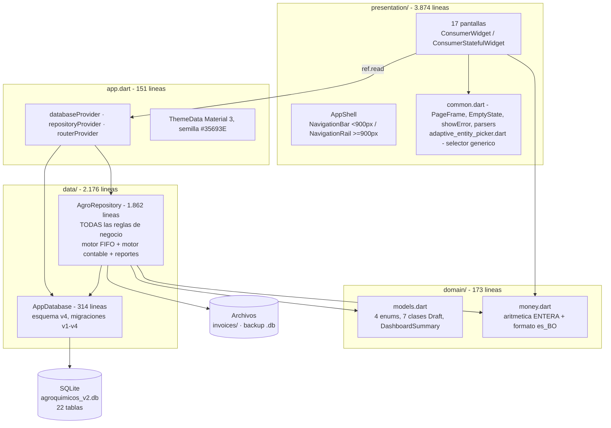
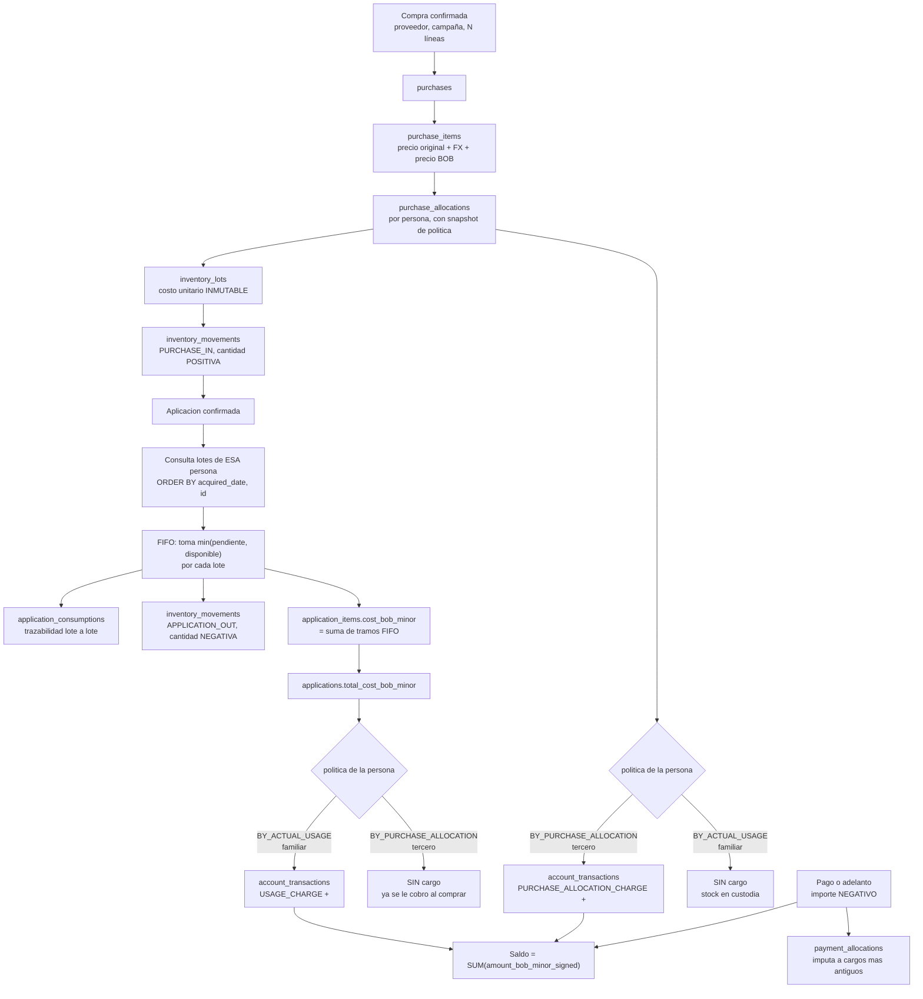
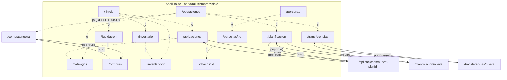
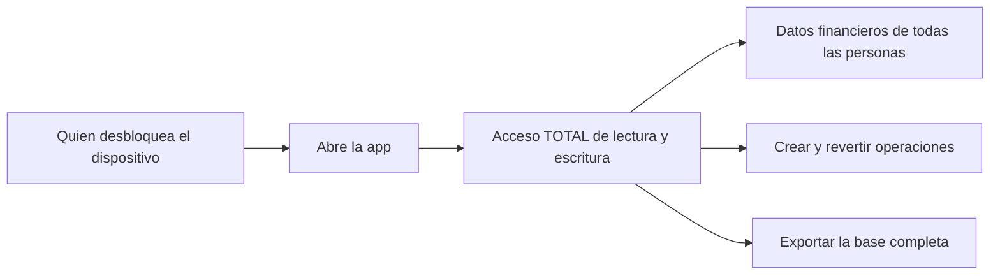
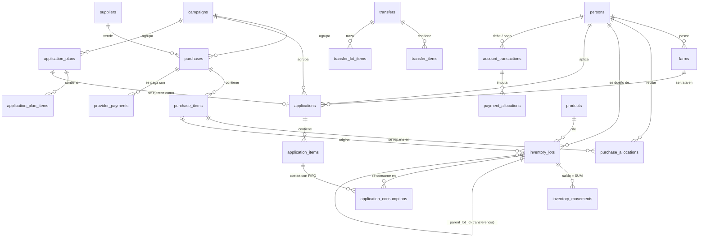
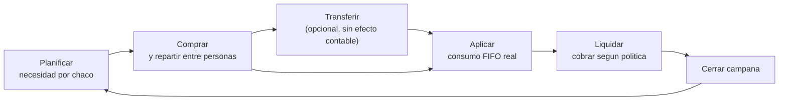

# 28 — Mapa del sistema

> **Documento principal.** Diseñado para que un desarrollador senior comprenda el sistema en
> 15–30 minutos sin haber participado en su desarrollo. Lee esto primero.

---

## System Overview

**Agrocuentas V2** (paquete Dart `agroquimicos`) es una aplicación **Flutter offline-only**
que resuelve un problema contable concreto de una familia de agricultores bolivianos:

> Varias personas compran agroquímicos **juntas en una misma factura**, a veces en dólares.
> Cada una recibe una parte, la aplica en sus chacos, y hay que saber **quién debe cuánto**.

La respuesta a "quién debe cuánto" **depende del tipo de persona**, y esa es la regla central
de todo el sistema:

| Rol | Se le cobra… | Momento del cargo | Asiento generado |
|---|---|---|---|
| `FAMILY` | por **consumo real** | al **aplicar** producto | `USAGE_CHARGE` |
| `THIRD_PARTY` | por **asignación de compra** | al **confirmar la compra** | `PURCHASE_ALLOCATION_CHARGE` |
| `ADMIN` | nada (`MANUAL`) | — | Paga a los proveedores; excluido de liquidaciones |

Todo el estado vive en **SQLite local**. No hay servidor, ni red, ni login, ni
sincronización.

### Números del sistema

| Métrica | Valor |
|---|---:|
| Líneas de código (`lib/`) | 8 250 |
| Líneas de test (`test/`) | 1 972 |
| Pantallas | 17 |
| Rutas | 17 (13 en shell + 4 de nivel superior) |
| Tablas SQLite | 22 (esquema v4) |
| Índices | 15 |
| Métodos públicos del repositorio | ~60 |
| Reglas de negocio confirmadas | 52 |
| Tests | 44 (todos en verde) |
| Dependencias directas de producción | 10 |
| Endpoints de API | **0** |

---

## High-Level Architecture

**No es Clean Architecture, ni MVVM, ni BLoC.** Son tres carpetas con un repositorio
monolítico que concentra persistencia y reglas de negocio.



### Las tres cosas que hay que entender antes de tocar nada

1. **La aritmética es entera, siempre.** Nada de `double` en dinero ni en cantidades.
   Cuatro escalas: `_base` (×1000, ml o g), `_minor` (×100, centavos), `_scaled` (×1e6,
   tipo de cambio), `_m2` (×10000, hectáreas → metros cuadrados).
2. **El inventario no guarda saldos.** El stock es siempre
   `SUM(inventory_movements.quantity_signed)`. Un lote no sabe cuánto le queda.
3. **La contabilidad es inmutable.** Nunca se hace `UPDATE`/`DELETE` sobre
   `account_transactions`. Corregir = insertar un asiento `CREDIT_ADJUSTMENT` compensatorio
   con `reversal_of_id`.

---

## Modules

| Módulo | Archivo | Responsabilidad |
|---|---|---|
| **Bootstrap** | `main.dart` (9 líneas) | `ProviderScope` + `AgroApp` |
| **Composición** | `app.dart` (151) | 3 providers + 17 rutas + tema |
| **Dominio** | `domain/models.dart` (129) | Enums, drafts de escritura, `DashboardSummary` |
| **Dinero** | `domain/money.dart` (44) | Redondeo mitad arriba, conversión FX, formateo |
| **Esquema** | `data/app_database.dart` (314) | 22 tablas, 15 índices, migraciones |
| **Núcleo** | `data/agro_repository.dart` (1 862) | **Todo lo demás** |
| **Navegación** | `presentation/app_shell.dart` (129) | Chrome adaptativo + FAB |
| **UI compartida** | `presentation/widgets/` (349) | `PageFrame`, `EmptyState`, parsers, selector |
| **Pantallas** | `presentation/screens/` (5 263) | 17 pantallas |

### Las seis responsabilidades dentro de `AgroRepository`

Están agrupadas físicamente en el archivo, lo que haría fácil dividirlo:

```
líneas   34– 265  Catálogos y campañas
líneas  267– 445  Motor de compras (confirmPurchase, addProviderPayment)
líneas  447– 634  Motor de aplicaciones + pagos de cuenta (FIFO, cargos)
líneas  636– 799  Reversiones (aplicación, compra)
líneas  801–1276  Transferencias (+ 2 métodos legacy muertos)
líneas 1285–1862  Consultas y reportes (~30 métodos de lectura)
```

---

## Main Data Flow

### Compra → Inventario → Aplicación → Deuda

Este es **el flujo central del sistema**. Si solo entiendes un diagrama, que sea este:



**Lee ese diagrama dos veces.** La bifurcación en `{política de la persona}` aparece dos
veces y en ramas opuestas: **esa simetría invertida es el modelo de negocio completo.**

### Ejemplo numérico verificado por test

```
1/1/2026  Compra 20 L a Bs 100,00/L  →  lote #1, unit_cost = 10 000 centavos
1/2/2026  Compra 30 L a Bs 115,00/L  →  lote #2, unit_cost = 11 500 centavos
1/3/2026  Aplicación de 50 L por un FAMILIAR

FIFO:  lote #1 → 20 L × 10 000 / 1000 = 200 000 centavos
       lote #2 → 30 L × 11 500 / 1000 = 345 000 centavos
       ────────────────────────────────────────────────
       total_cost_bob_minor = 545 000  =  Bs 5 450,00

→ account_transactions: USAGE_CHARGE +545 000
```

Test: `repository_test.dart` — *"FIFO consume lotes de costos diferentes y valoriza Bs 5.450"*.

---

## Navigation Map



**5 destinos** en el shell: Inicio · Operaciones · Inventario · Personas · Cuentas.
Las pantallas operativas (`/catalogos`, `/planificacion`, `/compras`, `/aplicaciones`,
`/transferencias`) se agrupan visualmente bajo **Operaciones**.

> ⚠️ **Defecto confirmado**: `context.go('/compras/nueva')` desde el FAB o desde Operaciones
> reemplaza la pila; el botón atrás del formulario provoca
> *"You have popped the last page off of the stack"* y deja la pantalla en blanco.
> Ver [27_KNOWN_ISSUES](27_KNOWN_ISSUES.md) KI-01.

---

## Authentication Flow

**No existe.** Sin login, sin sesión, sin tokens, sin biometría, sin cifrado.



`persons.role` es un atributo **de dominio**, no de seguridad: decide **cómo se cobra**, no
**quién puede hacer qué**. Ver [12_AUTHENTICATION](12_AUTHENTICATION.md).

---

## Data Persistence

### Modelo entidad-relación resumido



### Las tres tablas que hay que entender

| Tabla | Por qué importa |
|---|---|
| **`inventory_movements`** | El libro mayor del inventario. `quantity_signed` positivo = entrada, negativo = salida. **Todo el stock del sistema sale de sumar esta tabla.** 8 tipos de movimiento |
| **`inventory_lots`** | Guarda el **costo histórico inmutable** por lote, y `parent_lot_id` para transferencias. `acquired_date` gobierna el orden FIFO y **se hereda** en las transferencias |
| **`account_transactions`** | Libro de asientos inmutable. `amount_bob_minor_signed` positivo = cargo, negativo = pago/crédito. 5 tipos. Nunca se actualiza ni se borra |

### Almacenamiento en disco

| Qué | Dónde | Cifrado |
|---|---|:--:|
| Base de datos | Android/iOS: `<databasesPath>/agroquimicos_v2.db`<br/>Escritorio: `<appSupport>/agroquimicos_v2.db` | ❌ |
| Fotos de factura | `<documentos app>/invoices/invoice_<µs>.jpg` | ❌ |
| Backup | `<Descargas>/agroquimicos_backup_<ISO>.db` | ❌ |

**Sin `SharedPreferences`, sin secure storage, sin caché.** La tabla `app_settings` existe
pero nunca se usa.

---

## External Integrations

| Integración | Qué hace | Dónde |
|---|---|---|
| **Cámara** (`image_picker`) | Foto de factura | `purchase_form_screen.dart` |
| **Galería** (`image_picker`) | Foto de factura | `purchase_form_screen.dart` |
| **Sistema de archivos** (`dart:io` + `path_provider`) | Copiar imágenes, exportar backup | `agro_repository.dart` |
| **SQLite** (`sqflite` / `sqflite_common_ffi`) | Toda la persistencia | `app_database.dart` |

**Y nada más.** Sin red, sin API, sin nube, sin analítica, sin notificaciones, sin mapas.
El manifiesto de Android de release **no declara ni un solo permiso**, incluido `INTERNET`.

---

## Important Business Flows

### 1. Configuración inicial (orden obligatorio)

```
Personas (>=1 ADMIN + >=1 FAMILY/THIRD_PARTY)
  → Campaña (la primera queda ACTIVE automáticamente)
  → Chacos (requieren propietario)
  → Productos + Proveedores
```

Sin esto, comprar, planificar y aplicar están **bloqueados** por `_ensureCampaignActive` y
por las claves foráneas. La app arranca con la base **vacía** y sin ninguna guía.

### 2. Ciclo operativo típico



### 3. Invariante de campaña

Doble refuerzo, el mejor control de integridad del proyecto:

- **Motor**: `CREATE UNIQUE INDEX idx_campaign_single_active ON campaigns((1)) WHERE status='ACTIVE'`
- **Lógica**: `activateCampaign` lanza `CampaignConflictException` (que **lleva el nombre de
  la campaña en conflicto**, permitiendo a la UI ofrecer "Cerrar y activar").

Al cerrar una campaña **no se toca el inventario ni la deuda**: ambos continúan en la
siguiente. Confirmado por test.

### 4. Reversiones

| Operación | Guardias |
|---|---|
| **Compra** | Lotes no consumidos **y** saldo de lote igual al inicial. Revierte también los pagos al proveedor |
| **Transferencia** | El lote destino no puede haber tenido movimientos posteriores |
| **Aplicación** | **Ninguna** — siempre procede. Devuelve el plan a `PLANNED` |

Todas insertan movimientos compensatorios y `CREDIT_ADJUSTMENT`; **nada se borra**.
Ninguna pide confirmación en la UI ([KI-12](27_KNOWN_ISSUES.md)).

### 5. Imputación de pagos

Un pago se reparte contra los cargos **más antiguos primero**, y **cruza campañas**
deliberadamente: un pago de la campaña 2 cancela deuda de la campaña 1. El sobrante no se
imputa pero sí queda contabilizado, produciendo saldo a favor.

---

## Critical Files

Ordenados por lo que hay que leer primero:

| # | Archivo | Líneas | Por qué es crítico |
|---|---|---:|---|
| 1 | **`lib/data/agro_repository.dart`** | 1 862 | **Todo el negocio.** Si vas a tocar algo, empieza aquí. Métodos clave: `confirmPurchase`, `confirmApplication`, `transferProductsFifo`, `addAccountPayment`, las tres reversiones |
| 2 | **`lib/data/app_database.dart`** | 314 | Esquema v4 y migraciones. Léelo junto al anterior: las consultas no se entienden sin el esquema |
| 3 | **`lib/domain/money.dart`** | 44 | 44 líneas que gobiernan **toda** la exactitud monetaria del sistema. Lectura obligatoria |
| 4 | **`lib/domain/models.dart`** | 129 | Los enums y los drafts. Define el contrato de escritura |
| 5 | **`lib/app.dart`** | 151 | Providers, 17 rutas, tema |
| 6 | `lib/presentation/screens/purchase_form_screen.dart` | 772 | La pantalla más compleja. ~350 de sus líneas son **código muerto** |
| 7 | `lib/presentation/screens/application_form_screen.dart` | 584 | Segundo formulario más complejo; acoplamiento persona↔chaco y precarga desde plan |
| 8 | `lib/presentation/widgets/common.dart` | 118 | Parsers y `friendlyError`: los usan las 17 pantallas |
| 9 | `test/repository_test.dart` | 408 | **La mejor documentación ejecutable del negocio.** 11 tests con cifras exactas |
| 10 | `lib/presentation/app_shell.dart` | 129 | Navegación adaptativa; contiene el defecto KI-01 |

---

## Cheat sheet de convenciones

```
_base    ×1000     cantidad en ml (productos L) o g (productos KG)
_minor   ×100      dinero en centavos de boliviano
_scaled  ×1e6      tipo de cambio (7000000 = 7,00 Bs/USD)
_m2      ×10000    superficie (280000 = 28 ha)
_signed            valor con signo: + entrada/cargo, − salida/pago

Codigos persistidos:  SCREAMING_SNAKE  (via extension EnumCode)
Fechas:               ISO-8601 UTC en columnas TEXT
Redondeo:             SIEMPRE divideRoundedHalfUp — nunca round() ni floor()
Formato:              formatBob() y formatQuantity(), locale es_BO fijo
```

### Tipos de movimiento de inventario

`PURCHASE_IN` · `APPLICATION_OUT` · `APPLICATION_REVERSAL` · `PURCHASE_REVERSAL` ·
`TRANSFER_OUT` · `TRANSFER_IN` · `TRANSFER_REVERSAL_IN` · `TRANSFER_REVERSAL_OUT`

### Tipos de asiento contable

`PURCHASE_ALLOCATION_CHARGE` (+) · `USAGE_CHARGE` (+) · `PAYMENT` (−) · `ADVANCE` (−) ·
`CREDIT_ADJUSTMENT` (−)

---

## Lo primero que deberías arreglar

Si te dan el proyecto y una tarde:

| # | Qué | Dónde | Por qué |
|---|---|---|---|
| 1 | `context.go` → `context.push` para `/compras/nueva` | `app_shell.dart`, `operations_screen.dart` | Rompe la app hoy ([KI-01](27_KNOWN_ISSUES.md)) |
| 2 | `hasError` antes de `hasData` | `settlements_screen.dart`, `purchases_screen.dart` | Spinner infinito ante error ([KI-03](27_KNOWN_ISSUES.md)) |
| 3 | Firma de release real | `android/app/build.gradle.kts` | Hoy usa la clave de depuración ([S-01](23_SECURITY_AUDIT.md)) |
| 4 | `late Future` en `initState` | 4 pantallas con `_load(ref)` en `build` | Consultas repetidas y parpadeo ([P-01](25_PERFORMANCE_AUDIT.md)) |
| 5 | Borrar `_PurchaseDialog` | `purchases_screen.dart` | ~350 líneas muertas ([DT-01](26_TECHNICAL_DEBT.md)) |

Plan completo en [30_IMPROVEMENT_ROADMAP](30_IMPROVEMENT_ROADMAP.md).

---

## Lo que este sistema hace bien

Para calibrar expectativas: **este es un proyecto sólido**, no un desastre que rescatar.

- **Aritmética monetaria entera y consistente** en todo el sistema. Cero errores de coma
  flotante posibles.
- **Contabilidad inmutable con reversiones compensatorias**: diseño profesional correcto.
- **Trazabilidad FIFO completa**: se puede responder "de qué compra salió el producto que se
  aplicó aquel día".
- **Transacciones bien usadas**: rollback verificado por tres tests dedicados.
- **Consultas 100 % parametrizadas**: sin inyección SQL posible.
- **Doble y triple refuerzo** de las invariantes críticas (UI + repositorio + esquema).
- **Mensajes de error específicos, en español y orientados a la acción.**
- **44 tests en verde**, con aserciones sobre valores exactos, no sobre "no lanza".
- **`flutter analyze` sin avisos** y formato canónico aplicado.
- **Dependencias austeras**: 10 paquetes directos, ninguno abandonado, sin generación de
  código.
- **Snapshot de política** en `purchase_allocations`: cambiar el rol de una persona no
  reescribe la historia.
- **`acquired_date` heredado** en transferencias: el FIFO sigue siendo cronológicamente
  correcto tras mover stock.

Los problemas encontrados son **acotados y corregibles**, no estructurales-irreparables. El
mayor riesgo del producto **no es técnico sino operativo**: toda la contabilidad vive en un
solo archivo, en un solo teléfono, sin respaldo automático ni función de restauración.

---

# Actualización 2026-09-06 — Mapa al congelar la baseline

## Archivos nuevos en `lib/`

| Archivo | Responsabilidad |
|---|---|
| `lib/data/invoice_storage.dart` | **Único sitio que decide dónde viven las fotografías de factura.** Lo usan `AgroRepository.storeInvoiceImage` (que las guarda) y `BackupService` (que las empaqueta y las devuelve al restaurar). Antes cada uno lo calculaba por su cuenta, y bastaba con que uno cambiara para que el respaldo dejara de encontrar los archivos |

## Responsabilidades que crecieron

| Archivo | Qué añade |
|---|---|
| `lib/data/backup_service.dart` | Del `.db` suelto al contenedor `.agrobackup`: manifiesto con checksums, empaquetado y extracción con protección contra rutas fuera del destino, validación de los dos formatos, reconstrucción de rutas de fotografías y rollback del conjunto (base **y** fotos) |
| `lib/data/app_database.dart` | Esquema **v6** y su migración: vocabulario de estado de plan, reparación de los planes reabiertos por la regla anterior e índice único parcial sobre `applications(plan_id)` |
| `lib/data/agro_repository.dart` | `_ensurePlanNotApplied` (invariante del plan dentro de la transacción), rechazo de reactivar una campaña `CLOSED`, `plans(includeApplied:)` |
| `lib/presentation/app_shell.dart` | `hidesGlobalFab` y rail desplazable |

## Dónde viven ahora las invariantes

Merece la pena verlas juntas, porque es el patrón que esta baseline consolida: **una invariante
de los datos vive en el motor**, y la pantalla sólo evita ofrecer lo imposible.

| Invariante | En la base | En el dominio | En la pantalla |
|---|---|---|---|
| Exactamente una campaña activa | `idx_campaign_single_active` (único parcial) | `addCampaign`, `activateCampaign` | el menú ofrece "Activar" sólo donde procede |
| Una campaña cerrada es terminal | — | `activateCampaign` rechaza `CLOSED` | "Activar" sólo si está `PLANNED` |
| Un plan se aplica una sola vez | `idx_application_plan_single_use` (único parcial) | `_ensurePlanNotApplied`, dentro de la transacción | no se ofrece la acción sobre un plan aplicado |
| Un producto por línea de aplicación | `idx_application_item_unique` | `confirmApplication` | el selector excluye los ya usados |
| Un producto por línea de plan | `idx_plan_item_unique` | `addPlanMulti` | ídem |

## Verificación automática

`.github/workflows/flutter-ci.yml` es parte del sistema desde esta fase: reproduce los cuatro
gates en cada PR y en cada push a `main`. Ver
[`20_BUILD_AND_CONFIGURATION`](20_BUILD_AND_CONFIGURATION.md).
