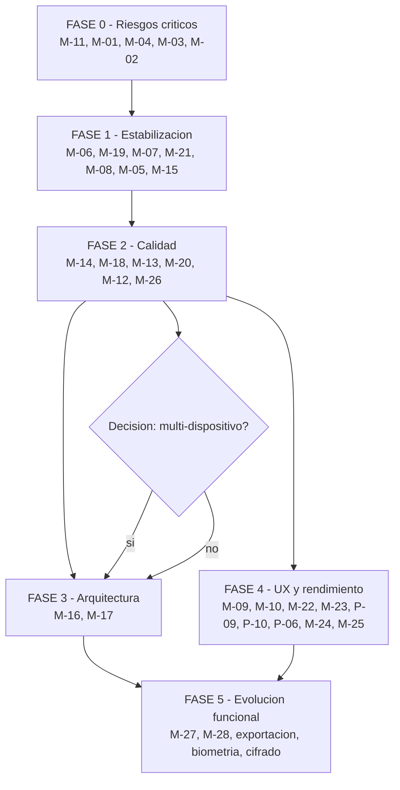

# 30 — Hoja de ruta de mejoras

Ordena las mejoras de [29_IMPROVEMENT_AUDIT](29_IMPROVEMENT_AUDIT.md) **estratégicamente**,
no por facilidad. El criterio de orden es, en este orden:

1. seguridad y distribución · 2. defectos que rompen la app · 3. integridad de datos ·
4. arquitectura · 5. mantenibilidad · 6. testing · 7. rendimiento · 8. UX ·
9. funcionalidad nueva

Dos principios que atraviesan todo el plan:

> **El test va antes que el arreglo** cuando el arreglo cambia cifras o toca migraciones.
> **No se refactoriza sin la suite en verde.**

---

## FASE 0 — Riesgos críticos

**Objetivo**: que la app no se rompa, que se pueda distribuir, y que no se corrompan datos
en la próxima actualización.

| # | Mejora | Complejidad | Riesgo de regresión |
|---|---|---|---|
| 0.1 | **M-11** · Test de navegación sobre `AgroApp` completo | Medium | Ninguno |
| 0.2 | **M-01** · `go` → `push` para `/compras/nueva` | Low | Bajo |
| 0.3 | **M-04** · Test de equivalencia de esquema tras migración | Medium | Ninguno |
| 0.4 | **M-03** · Corregir la divergencia de índices (migración v5) | Medium | **Medio-alto** |
| 0.5 | **M-02** · Configurar la firma de release | Low | Ninguno en código |

**Orden interno, y por qué importa**: 0.1 antes que 0.2, y 0.3 antes que 0.4. En ambos casos
**el test se escribe primero**: uno debe fallar antes del arreglo y pasar después; el otro
debe existir antes de tocar migraciones sobre datos reales de usuarios.

**Criterio de salida**
- La navegación desde las tres vías al formulario de compra funciona; el test lo cubre.
- Una base migrada desde v1, v2 y v3 produce **el mismo esquema** que una creada desde cero,
  índices y su atributo `unique` incluidos.
- Existe un keystore de release custodiado, con copia de seguridad.
- 44 + N tests en verde.

**Bloqueantes**
- M-02 requiere saber si se publicará en Google Play o solo se distribuirá el APK.
- M-03 requiere decidir qué hacer si una base existente ya tuviera duplicados.

---

## FASE 1 — Estabilización

**Objetivo**: eliminar los defectos que producen datos incorrectos o dejan al usuario
atascado, y ganar capacidad de diagnóstico.

| # | Mejora | Complejidad | Riesgo de regresión |
|---|---|---|---|
| 1.1 | **M-06** · `hasError` antes de `hasData` en 2 pantallas | Low | Muy bajo |
| 1.2 | **M-19** · Tests de reportes y agregados | Medium | Ninguno |
| 1.3 | **M-07** · `productCostReport`: condición al `ON` | Low | Bajo |
| 1.4 | **M-21** · Valor de inventario: quitar `CASE` muerto y truncamiento | Low | Bajo |
| 1.5 | **M-08** · Logging local rotativo + `FlutterError.onError` | Low-Medium | Bajo |
| 1.6 | **M-05** · Restauración de backup (fases 1 y 2) | Medium | **Alto** |
| 1.7 | **M-15** · Traducir `DatabaseException`; unificar `friendlyError` | Low | Muy bajo |

**Orden interno**: 1.2 va **antes** que 1.3 y 1.4, porque ambas cambian cifras visibles y el
test debe fijar el comportamiento esperado antes de tocarlas.

**Por qué M-05 está aquí y no más abajo**
Es la mejora de mayor valor real para el usuario de todo el plan. Hoy el producto tiene un
**punto único de fallo total**: toda la contabilidad en un archivo, en un teléfono, sin
respaldo automático ni forma de restaurar. Ningún defecto de código de este informe puede
causar tanto daño como perder el dispositivo.

**Criterio de salida**
- Ningún error deja una pantalla cargando indefinidamente.
- Los reportes tienen tests con cifras exactas y son correctos al filtrar por campaña.
- Existe un log local exportable para diagnosticar incidencias.
- El usuario puede **restaurar** un backup, y el backup incluye las fotos.
- El usuario nunca ve un mensaje técnico de SQLite.

---

## FASE 2 — Calidad y confianza

**Objetivo**: reducir la superficie de mantenimiento y cerrar los huecos de validación,
preparando el terreno para los cambios estructurales de la Fase 3.

| # | Mejora | Complejidad | Riesgo de regresión |
|---|---|---|---|
| 2.1 | **M-14** · Eliminar ~400 líneas de código muerto | Low | Muy bajo |
| 2.2 | **M-18** · Cerrar los huecos H-01, H-02, H-03 en el repositorio | Low | Bajo |
| 2.3 | **M-13** · Extraer el motor FIFO a un único lugar | Medium | **Medio** |
| 2.4 | **M-20** · Integración continua | Low | Ninguno |
| 2.5 | **M-12** · `late Future` en `initState` en 4 pantallas | Low | Bajo |
| 2.6 | **M-26** · Quitar `cupertino_icons` y `fake_async` | Low | Muy bajo |

**Orden interno**: 2.1 antes que 2.3 — borrar `transferProductFifoV3Legacy` reduce las
copias del FIFO de cuatro a tres antes de unificarlas.

**Por qué la CI entra aquí**
A partir de la Fase 3 los cambios son estructurales. Sin CI, cada refactorización depende de
que alguien recuerde ejecutar los cuatro comandos. Los cuatro **ya pasan hoy**, así que el
flujo nace en verde.

**Criterio de salida**
- `purchases_screen.dart` baja de 658 a ~300 líneas.
- Una sola implementación del algoritmo FIFO.
- Las reglas de negocio no dependen de que la interfaz las respete.
- Cada cambio ejecuta formato, análisis, tests y build automáticamente.

---

## FASE 3 — Arquitectura

**Objetivo**: levantar el techo de mantenibilidad. Es la fase más cara y la que **no debe
abordarse sin las anteriores completas**.

| # | Mejora | Complejidad | Riesgo de regresión |
|---|---|---|---|
| 3.1 | **M-16** · Modelos de lectura tipados (incremental) | High | Medio |
| 3.2 | **M-17** · Dividir `AgroRepository` en 6 servicios | High | **Medio-alto** |

**Precondiciones obligatorias**
- Fases 0–2 completas.
- Suite en verde y cobertura medida (M-20).
- Tests de reportes existentes (M-19), porque son las consultas que más se tocan al tipar.

**Estrategia de M-16 — incremental, nunca de golpe**

No convertir las ~20 consultas a la vez. Por cada una:

1. Crear la clase con constructor `fromRow(Map<String, Object?>)`.
2. Cambiar la firma del método del repositorio.
3. Dejar que el analizador señale todos los sitios rotos.
4. Corregirlos, ejecutar la suite, entregar.

**El compilador es el aliado**: cada paso rompe la compilación hasta estar completo, lo que
es mucho más seguro que descubrir el fallo en runtime.

Orden sugerido, de mayor a menor uso: `inventorySummary` → `availableProductsForOwner` →
`settlements` → `applications` → `purchases` → el resto.

**Estrategia de M-17**

La división es mecánicamente sencilla porque **los seis grupos ya están agrupados
físicamente** en el archivo (ver [28_SYSTEM_MAP](28_SYSTEM_MAP.md) → Modules). Extraer clase
a clase, manteniendo `AgroRepository` como fachada delegadora hasta que todas las llamadas
migren, y eliminarla después.

**Criterio de salida**
- Ningún `as int` / `as String` sobre `Map` en la capa de presentación.
- Ningún archivo de `lib/` supera las ~500 líneas.
- Suite en verde sin cambios en las aserciones de negocio.

---

## FASE 4 — UX y rendimiento

**Objetivo**: pulir lo que el usuario percibe.

| # | Mejora | Complejidad | Riesgo de regresión |
|---|---|---|---|
| 4.1 | **M-09** · Confirmación antes de revertir | Low | Muy bajo |
| 4.2 | **M-10** · Fecha editable en operaciones | Low | Bajo |
| 4.3 | **M-22** · `formatHectares` y etiquetas de rol centralizadas | Low | Muy bajo |
| 4.4 | **M-23** · Estados vacíos faltantes y primera ejecución guiada | Low | Ninguno |
| 4.5 | Debounce en `estimateFifoCost` (P-09) | Low | Bajo |
| 4.6 | `cacheWidth` en `Image.file` (P-10) | Low | Ninguno |
| 4.7 | Búsqueda de `ApplicationsScreen` sobre campos concretos (P-06) | Low | Bajo |
| 4.8 | **M-24** · Unificar el naming del producto | Low | Ninguno |
| 4.9 | **M-25** · Actualizar el README | Low | Ninguno |

**Nota sobre M-10**: aunque es "solo interfaz", **afecta a los datos**: `acquired_date`
gobierna el orden FIFO. Debe acompañarse de un test que confirme que el costeo sigue siendo
correcto con fechas retroactivas.

**Nota sobre 4.5**: es el caso más claro del proyecto donde 200–300 ms de retardo eliminan
la mayoría de las consultas sin que el usuario note diferencia. Con 5 productos en la mezcla,
cada dígito tecleado en el área lanza hoy 5 consultas.

---

## FASE 5 — Evolución funcional

**Objetivo**: crecer sobre una base ya sana. **Nada de esto debe abordarse antes de la
Fase 2.**

| # | Mejora | Complejidad | Decisión previa necesaria |
|---|---|---|---|
| 5.1 | **M-27** · Trazabilidad de autoría | Medium | ¿Uno o varios operadores? |
| 5.2 | **M-28** · Decidir el futuro de la web | Low / High | ¿Es la web un objetivo? |
| 5.3 | Filtros de la bitácora de chaco (ya soportados en datos) | Low | — |
| 5.4 | Exportación a CSV o PDF de estados de cuenta y reportes | Medium | — |
| 5.5 | Bloqueo opcional por biometría o PIN ([S-05](23_SECURITY_AUDIT.md)) | Medium | Contexto de uso |
| 5.6 | Notificaciones locales de stock negativo y planes pendientes | Medium | — |
| 5.7 | Cifrado de la base de datos ([S-02](23_SECURITY_AUDIT.md)) | High | Contexto de uso |
| 5.8 | Edición de operaciones confirmadas (hoy solo reversión) | High | Diseño contable |

### La decisión que hay que tomar pronto: multi-dispositivo

**DT-13** ([26_TECHNICAL_DEBT](26_TECHNICAL_DEBT.md)) es la única deuda de este informe cuyo
coste **crece con cada dato que se acumula**:

> Todas las claves primarias son `INTEGER AUTOINCREMENT`. Dos instalaciones generan el id `1`
> para entidades distintas. **Fusionar dos bases es imposible sin rediseño.**

- Si multi-dispositivo **no** está en el horizonte: esta deuda **no existe**, y no hay que
  hacer nada. Los ids locales son la elección correcta para una app de un solo dispositivo.
- Si **sí** lo está: la migración a UUID debe planificarse **antes** de acumular volumen, y
  se convierte en un elemento de Fase 3, no de Fase 5.

`REQUIERE INFORMACIÓN DEL DESARROLLADOR`. **Esta es la pregunta de producto de mayor impacto
técnico del proyecto**, y conviene responderla antes de empezar la Fase 3.

---

## Vista de conjunto

La Fase 4 puede solaparse con la Fase 3: son cambios de interfaz sobre pantallas que la
refactorización de tipos toca de todos modos, y pueden hacerse en el mismo paso.

---

## Reglas de trabajo para todas las fases

1. **La suite verde es la línea base.** Hoy son 44 tests. Nunca entregar con la suite roja.
2. **Test primero** cuando el cambio afecta a cifras o a migraciones (M-04 antes de M-03;
   M-19 antes de M-07 y M-21).
3. **Los cuatro comandos del README** antes de cada entrega:
   `dart format --set-exit-if-changed` · `flutter analyze` · `flutter test` ·
   `flutter build apk --debug`.
4. **Nada de refactorizar y arreglar en el mismo cambio.** Separar siempre corrección de
   comportamiento de reorganización de código.
5. **Actualizar `docs/`** cuando el cambio invalide algo de esta documentación. La
   desactualización del README (DT-09) es exactamente lo que hay que evitar repetir.
6. **Poner el proyecto bajo control de versiones** ([KI-20](27_KNOWN_ISSUES.md)) antes de
   empezar cualquier fase. Sin historial, ninguna de estas recomendaciones es reversible.

---

## Si solo hay tiempo para una tarde

En orden estricto de valor por hora invertida:

| # | Acción | Tiempo estimado | Qué resuelve |
|---|---|---|---|
| 1 | **M-01** — `go` → `push` en dos archivos | ~15 min | La app deja de romperse ([KI-01](27_KNOWN_ISSUES.md)) |
| 2 | **M-06** — mover `hasError` arriba en dos pantallas | ~10 min | Fin del spinner infinito |
| 3 | **M-02** — configurar la firma de release | ~30 min | Se puede publicar |
| 4 | **M-14** — borrar el código muerto | ~30 min | −400 líneas |
| 5 | **M-12** — `late Future` en cuatro pantallas | ~45 min | Fin del parpadeo y de las consultas repetidas |

Aproximadamente dos horas para eliminar el defecto que rompe la app, el que la deja colgada,
el que impide distribuirla, y los dos problemas de código más visibles.

---

# Actualización 2026-09-06 — Qué queda tras congelar la baseline

La baseline `v1.0.0-base-stable` cierra el proyecto base. Este roadmap deja de ser una lista de
arreglos pendientes: **no queda ningún defecto abierto**. Lo que sigue son funcionalidades.

## Ya hecho de este roadmap

| Elemento | Estado |
|---|---|
| Respaldo que incluya las fotografías de factura | ✅ contenedor `.agrobackup` con manifiesto, checksums y compatibilidad hacia atrás |
| Verificación automática en CI | ✅ GitHub Actions con los cuatro gates |
| Estado de plan en el esquema | ✅ esquema v6, con la invariante en el motor |
| Cerrar el ciclo de vida de campañas | ✅ `CLOSED` terminal, protegido en el dominio |
| Cobertura de la entrada numérica y del respaldo en Android | ✅ desde fases anteriores; ampliada a 253 tests |

## Evolución diferida — funcionalidades, no defectos

Copiado y ampliado desde [`46` sección 16](46_BASELINE_FINAL_FREEZE.md), que es la fuente:

| Prioridad sugerida | Elemento | Nota |
|---|---|---|
| Alta | **Compartir el respaldo con el selector del sistema** | Hoy el archivo vive en la carpeta de la aplicación y sobrevive a un borrado de datos, pero **no a desinstalar**. Poder enviarlo a Drive o a WhatsApp cierra el último hueco de la recuperación |
| Alta | **Informes exportables** (PDF/CSV) | La liquidación por campaña es lo que el propietario acaba copiando a mano |
| Media | **Duplicar un plan aplicado** como punto de partida de uno nuevo | Atajo de conveniencia. La regla de un solo uso **no** cambia: crea un plan nuevo, no revive el viejo |
| Media | **Reapertura administrativa de una campaña cerrada** | Sólo si aparece una necesidad real. Debe ser explícita y auditable, con su propia traza: no un botón escondido |
| Media | Purga o archivado de fotografías antiguas | Con su efecto sobre el tamaño del respaldo declarado |
| Baja | Cifrado del respaldo | Hoy el archivo no está cifrado, igual que antes |
| Baja | **Modelos tipados** en lugar de `Map<String, Object?>`, y división de `AgroRepository` por áreas | **Deliberadamente fuera de la baseline.** La meta de la fase era cerrarla, no reabrir la arquitectura. Con 253 tests verdes y CI, ahora es un refactor con red |

## Criterio de arranque

Toda evolución parte de `main` **posterior al tag** `v1.0.0-base-stable`, mediante ramas de
feature. La baseline histórica no se toca: es el punto exacto de recuperación
([`46` sección 18](46_BASELINE_FINAL_FREEZE.md)).
